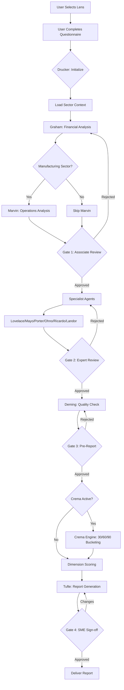
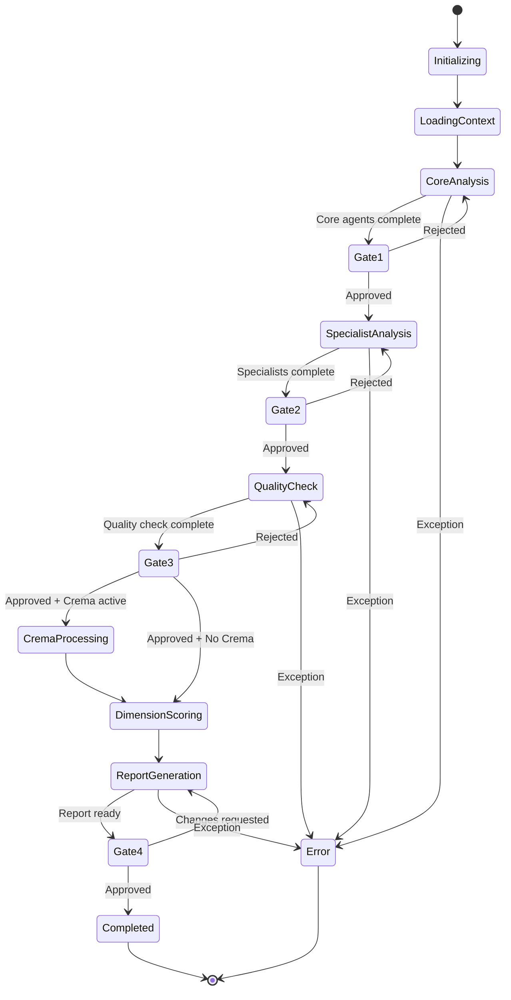
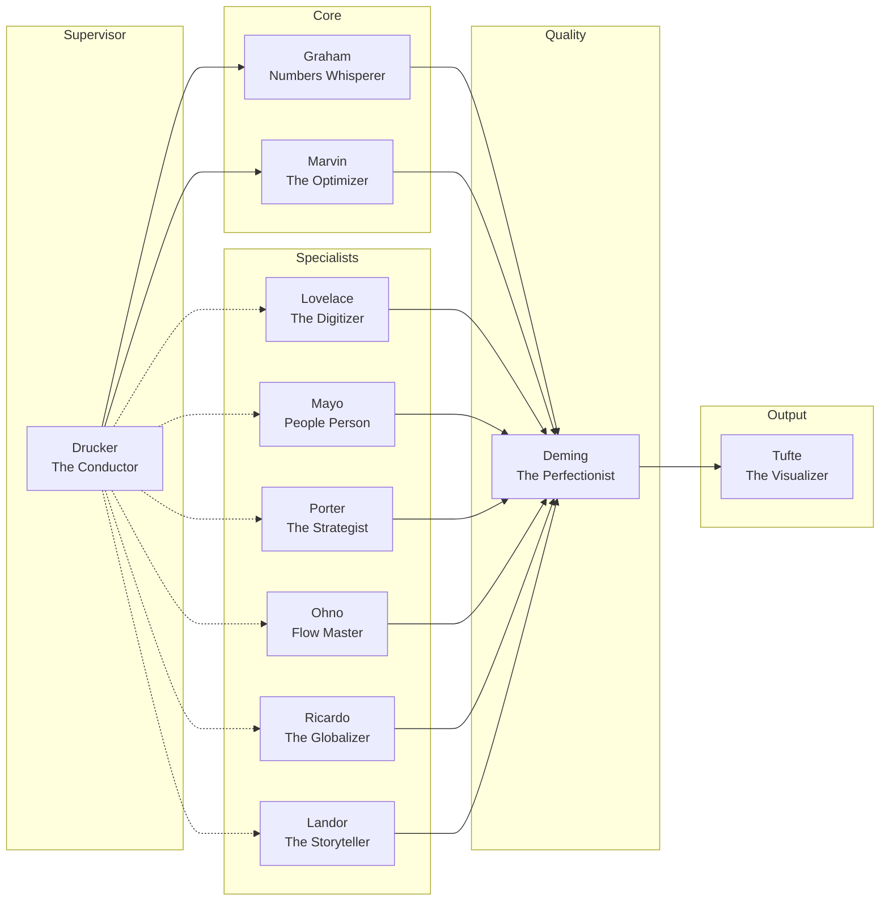

# RootRise Architecture v7.0
## Technical Handoff Document

**For:** Ahmed El-Gazzar (Technical DevOps Lead)  
**Document Version:** 7.0  
**Date:** January 2026  
**Prepared by:** Tee (Product Creative Strategist / The Ionganic Orchestrator)

---

## Table of Contents

1. [Executive Summary](#1-executive-summary)
2. [Architecture Overview](#2-architecture-overview)
3. [The Pantheon: 11 AI Agents](#3-the-pantheon-11-ai-agents)
4. [LangGraph Node Specifications](#4-langgraph-node-specifications)
5. [Agent Communication Protocols](#5-agent-communication-protocols)
6. [The Lens System: 17 Lenses](#6-the-lens-system-17-lenses)
7. [Sector Knowledge Packs: 31 Sectors](#7-sector-knowledge-packs-31-sectors)
8. [Questionnaire System v2.0](#8-questionnaire-system-v20)
9. [11-Dimension Scoring System](#9-11-dimension-scoring-system)
10. [The Crema: Quick Wins Engine](#10-the-crema-quick-wins-engine)
11. [Report Generation System](#11-report-generation-system)
12. [UI → Backend API Mapping](#12-ui--backend-api-mapping)
13. [Workflow Diagrams](#13-workflow-diagrams)
14. [Frappe Backend Integration](#14-frappe-backend-integration)
15. [Implementation Priorities](#15-implementation-priorities)
16. [Appendices](#16-appendices)

---

# 1. Executive Summary

## 1.1 Purpose

This document provides complete technical specifications for implementing the RootRise v7.0 multi-agent architecture. It covers LangGraph node specifications, agent communication protocols, data schemas, API mappings, and implementation priorities aligned with the January 2026 documentation.

## 1.2 Architecture Overview

RootRise v7.0 introduces a **three-layer configurable architecture** enabling SMEs to build personalized diagnostic experiences:

| Layer | Component | Count | Description |
|-------|-----------|-------|-------------|
| **Layer 1** | The Lens System | 17 | Strategic transformation focuses that route questions and prioritize agents |
| **Layer 2** | The Pantheon | 11 | Specialist AI agents named after business/technology pioneers |
| **Layer 3** | Sector Knowledge | 31 | Industry-specific knowledge packs with MENA context |

## 1.3 Key Numbers (v7.0)

| Component | Count | Change from v6 |
|-----------|-------|----------------|
| AI Agents | 11 | — |
| Strategic Lenses | 17 | +2 (was 15) |
| Sector Knowledge Packs | 31 | +4 (was 27) |
| Country Coverage | 6 | +2 (was 4) |
| Questionnaire Sections | 12 | +2 (was 10) |
| Scoring Dimensions | 11 | New |
| Report Types | 8 | +4 (was 4) |
| Total Questions | ~160 | +15 |

## 1.4 What's New in v7.0

1. **Lens System Expansion:** Added EYE-CREMA (Quick Wins) and EYE-CUSTOM (Custom Objective) as special lenses
2. **Country Expansion:** Added Lebanon (LB) and Morocco (MA) to coverage
3. **Sector Packs v2.0:** All 31 packs upgraded with enhanced agent instructions
4. **Questionnaire v2.0:** Added lens_relevance, quick_win_indicator, effort_level fields
5. **11-Dimension Scoring:** Comprehensive scoring across all business dimensions
6. **Crema Engine:** Full 30/60/90 day quick win bucketing system
7. **8 Report Types:** Added specialized lens reports (Investor Ready, Export Roadmap, etc.)
8. **Agent Naming Update:** Removed "The" prefix from agent references in code (The Drucker → Drucker)

---

# 2. Architecture Overview

## 2.1 System Architecture Diagram

```
┌─────────────────────────────────────────────────────────────────────────────┐
│                              FRONTEND (React/Next.js)                        │
│  ┌─────────────┐  ┌─────────────┐  ┌─────────────┐  ┌─────────────┐        │
│  │ Lens Select │  │Questionnaire│  │  Dashboard  │  │   Reports   │        │
│  └─────────────┘  └─────────────┘  └─────────────┘  └─────────────┘        │
└────────────────────────────────┬────────────────────────────────────────────┘
                                 │ REST API / WebSocket
┌────────────────────────────────┴────────────────────────────────────────────┐
│                              API GATEWAY (Frappe)                            │
│  ┌─────────────┐  ┌─────────────┐  ┌─────────────┐  ┌─────────────┐        │
│  │   Auth      │  │  Sessions   │  │  Storage    │  │  Real-time  │        │
│  └─────────────┘  └─────────────┘  └─────────────┘  └─────────────┘        │
└────────────────────────────────┬────────────────────────────────────────────┘
                                 │ Internal API
┌────────────────────────────────┴────────────────────────────────────────────┐
│                         LANGGRAPH ORCHESTRATION                              │
│                                                                              │
│  ┌──────────────────────────────────────────────────────────────────────┐  │
│  │                         DRUCKER (Supervisor)                          │  │
│  │                         The Conductor                                 │  │
│  └──────────────────────────────┬───────────────────────────────────────┘  │
│                                 │                                           │
│  ┌──────────────────────────────┴───────────────────────────────────────┐  │
│  │                         THE PANTHEON (11 Agents)                      │  │
│  │  ┌────────┐ ┌────────┐ ┌────────┐ ┌────────┐ ┌────────┐ ┌────────┐  │  │
│  │  │ Graham │ │ Marvin │ │Lovelace│ │  Mayo  │ │ Porter │ │  Ohno  │  │  │
│  │  └────────┘ └────────┘ └────────┘ └────────┘ └────────┘ └────────┘  │  │
│  │  ┌────────┐ ┌────────┐ ┌────────┐ ┌────────┐                        │  │
│  │  │ Deming │ │Ricardo │ │ Landor │ │ Tufte  │                        │  │
│  │  └────────┘ └────────┘ └────────┘ └────────┘                        │  │
│  └──────────────────────────────────────────────────────────────────────┘  │
└────────────────────────────────┬────────────────────────────────────────────┘
                                 │
┌────────────────────────────────┴────────────────────────────────────────────┐
│                           KNOWLEDGE LAYER                                    │
│  ┌─────────────────┐  ┌─────────────────┐  ┌─────────────────┐             │
│  │  Lens Configs   │  │  Sector Packs   │  │  Questionnaire  │             │
│  │   (17 lenses)   │  │  (31 sectors)   │  │    Schema v2.0  │             │
│  └─────────────────┘  └─────────────────┘  └─────────────────┘             │
│                                                                              │
│  ┌─────────────────────────────────────────────────────────────────────┐   │
│  │                    VECTOR DATABASE (Qdrant)                          │   │
│  │  Sector embeddings, benchmark data, regulatory context               │   │
│  └─────────────────────────────────────────────────────────────────────┘   │
└─────────────────────────────────────────────────────────────────────────────┘
```

## 2.2 Data Flow

```
1. User selects Lens(es) → LS_001, LS_002
2. User completes Questionnaire → Routed by lens configuration
3. Drucker receives DiagnosticState → Activates relevant agents
4. Agents process in parallel/sequence → Based on dependencies
5. Each agent outputs findings → Tagged with confidence, effort_level
6. Crema Engine filters → If EYE-CREMA active, buckets into 30/60/90
7. Dimension scores calculated → 11 dimensions aggregated
8. Tufte generates report → Based on report_type selected
9. Human validation gates → 4 gates before final delivery
10. Report delivered → PDF/Dashboard/Presentation
```

---

# 3. The Pantheon: 11 AI Agents

## 3.1 Agent Registry

```typescript
interface AgentProfile {
  agent_id: string;
  name: string;
  persona: string;
  icon: string;
  domain: string;
  methodology: string;
  primary_dimensions: number[];  // D1-D11
  activation_triggers: string[];
  output_types: string[];
}

const AGENT_REGISTRY: Record<string, AgentProfile> = {
  
  drucker: {
    agent_id: "drucker",
    name: "Drucker",
    persona: "The Conductor",
    icon: "🎯",
    domain: "Orchestration & Strategy",
    methodology: "Management by Objectives",
    primary_dimensions: [1, 9],  // Business Model, Market Position
    activation_triggers: ["always"],  // Always active
    output_types: ["orchestration_plan", "agent_sequence", "report_structure"]
  },
  
  graham: {
    agent_id: "graham",
    name: "Graham",
    persona: "The Numbers Whisperer",
    icon: "💎",
    domain: "Financial Analysis",
    methodology: "Value Investing Principles",
    primary_dimensions: [2],  // Financial Health
    activation_triggers: ["always"],  // Always active
    output_types: ["financial_assessment", "investment_readiness", "benchmark_comparison"]
  },
  
  marvin: {
    agent_id: "marvin",
    name: "Marvin",
    persona: "The Optimizer",
    icon: "⚙️",
    domain: "Operations & Efficiency",
    methodology: "Lean Manufacturing, Systems Thinking",
    primary_dimensions: [6],  // Operational Efficiency
    activation_triggers: ["lens:EYE-004", "lens:EYE-012", "sector:manufacturing"],
    output_types: ["operations_assessment", "efficiency_opportunities", "process_gaps"]
  },
  
  lovelace: {
    agent_id: "lovelace",
    name: "Lovelace",
    persona: "The Digitizer",
    icon: "🔮",
    domain: "Technology & Digital Transformation",
    methodology: "Digital Maturity Models",
    primary_dimensions: [3],  // Digital & Systems
    activation_triggers: ["lens:EYE-003", "lens:EYE-010"],
    output_types: ["digital_assessment", "technology_roadmap", "system_recommendations"]
  },
  
  mayo: {
    agent_id: "mayo",
    name: "Mayo",
    persona: "The People Person",
    icon: "🌱",
    domain: "HR & Organizational Culture",
    methodology: "Human Relations Theory",
    primary_dimensions: [7],  // People & Culture
    activation_triggers: ["lens:EYE-007", "lens:EYE-014"],
    output_types: ["workforce_assessment", "culture_analysis", "succession_plan"]
  },
  
  porter: {
    agent_id: "porter",
    name: "Porter",
    persona: "The Strategist",
    icon: "♟️",
    domain: "Market & Competitive Strategy",
    methodology: "Five Forces, Value Chain Analysis",
    primary_dimensions: [9],  // Market Position
    activation_triggers: ["lens:EYE-005", "lens:EYE-011", "lens:EYE-015"],
    output_types: ["market_analysis", "competitive_positioning", "growth_strategy"]
  },
  
  ohno: {
    agent_id: "ohno",
    name: "Ohno",
    persona: "The Flow Master",
    icon: "🌊",
    domain: "Supply Chain & Logistics",
    methodology: "Toyota Production System, JIT",
    primary_dimensions: [8],  // Supply Chain
    activation_triggers: ["lens:EYE-008", "sector:manufacturing", "sector:trading"],
    output_types: ["supply_chain_assessment", "flow_optimization", "inventory_analysis"]
  },
  
  deming: {
    agent_id: "deming",
    name: "Deming",
    persona: "The Perfectionist",
    icon: "📐",
    domain: "Quality & Compliance",
    methodology: "PDCA, 14 Points for Management",
    primary_dimensions: [4, 10],  // Processes & Documentation, Compliance
    activation_triggers: ["lens:EYE-009", "lens:EYE-013", "validation_gate"],
    output_types: ["quality_assessment", "compliance_audit", "certification_roadmap"]
  },
  
  ricardo: {
    agent_id: "ricardo",
    name: "Ricardo",
    persona: "The Globalizer",
    icon: "🧭",
    domain: "Export & International Trade",
    methodology: "Comparative Advantage Theory",
    primary_dimensions: [11],  // International Readiness
    activation_triggers: ["lens:EYE-001"],
    output_types: ["export_assessment", "market_entry_plan", "certification_requirements"]
  },
  
  landor: {
    agent_id: "landor",
    name: "Landor",
    persona: "The Storyteller",
    icon: "📣",
    domain: "Brand & Marketing",
    methodology: "Brand Architecture, Positioning",
    primary_dimensions: [5, 9],  // Product/Service Quality, Market Position
    activation_triggers: ["lens:EYE-006", "lens:EYE-011"],
    output_types: ["brand_assessment", "marketing_strategy", "communication_plan"]
  },
  
  tufte: {
    agent_id: "tufte",
    name: "Tufte",
    persona: "The Visualizer",
    icon: "📊",
    domain: "Data Visualization & Reporting",
    methodology: "Information Design Principles",
    primary_dimensions: [],  // Meta-agent, processes all dimensions
    activation_triggers: ["report_generation"],
    output_types: ["diagnostic_report", "executive_summary", "dashboard_data"]
  }
};
```

## 3.2 Agent Hierarchy

```
SUPERVISOR TIER
└── Drucker (always active, orchestrates all)

CORE TIER (always active)
├── Graham (financial baseline required for all diagnostics)
└── Marvin (operational baseline for manufacturing/hybrid)

SPECIALIST TIER (lens/sector activated)
├── Lovelace (digital transformation)
├── Mayo (workforce development)
├── Porter (market strategy)
├── Ohno (supply chain)
├── Deming (quality & compliance)
├── Ricardo (export & trade)
└── Landor (brand & marketing)

UTILITY TIER
└── Tufte (report generation, always final step)
```

## 3.3 Agent Activation Matrix

| Lens | Drucker | Graham | Marvin | Lovelace | Mayo | Porter | Ohno | Deming | Ricardo | Landor | Tufte |
|------|---------|--------|--------|----------|------|--------|------|--------|---------|--------|-------|
| EYE-001 Export | ✓ | ✓ | ○ | ○ | ○ | ○ | ○ | ◐ | **✓** | ◐ | ✓ |
| EYE-002 Investment | ✓ | **✓** | ◐ | ○ | ○ | ◐ | ○ | ◐ | ○ | ○ | ✓ |
| EYE-003 Digital | ✓ | ◐ | ◐ | **✓** | ◐ | ○ | ○ | ○ | ○ | ○ | ✓ |
| EYE-004 Operations | ✓ | ◐ | **✓** | ◐ | ○ | ○ | ◐ | **✓** | ○ | ○ | ✓ |
| EYE-005 Market | ✓ | ◐ | ○ | ○ | ○ | **✓** | ○ | ○ | ○ | ◐ | ✓ |
| EYE-006 Brand | ✓ | ○ | ○ | ◐ | ○ | ◐ | ○ | ○ | ○ | **✓** | ✓ |
| EYE-007 Workforce | ✓ | ◐ | ○ | ○ | **✓** | ○ | ○ | ○ | ○ | ○ | ✓ |
| EYE-008 Supply Chain | ✓ | ◐ | ◐ | ○ | ○ | ○ | **✓** | ○ | ○ | ○ | ✓ |
| EYE-009 ESG | ✓ | ○ | ◐ | ○ | ○ | ○ | ○ | **✓** | ○ | ○ | ✓ |
| EYE-010 Innovation | ✓ | ◐ | ○ | **✓** | ○ | ◐ | ○ | ○ | ○ | ○ | ✓ |
| EYE-011 Customer | ✓ | ○ | ◐ | ○ | ○ | **✓** | ○ | ○ | ○ | ◐ | ✓ |
| EYE-012 Cost | ✓ | **✓** | **✓** | ○ | ○ | ○ | ◐ | ○ | ○ | ○ | ✓ |
| EYE-013 Risk | ✓ | ◐ | ○ | ○ | ○ | ○ | ◐ | **✓** | ○ | ○ | ✓ |
| EYE-014 Succession | ✓ | ○ | ○ | ○ | **✓** | ○ | ○ | ◐ | ○ | ○ | ✓ |
| EYE-015 Partnership | ✓ | ◐ | ○ | ○ | ○ | **✓** | ◐ | ○ | ○ | ○ | ✓ |
| EYE-CREMA | ✓ | ✓ | ✓ | ✓ | ✓ | ✓ | ✓ | ✓ | ✓ | ✓ | ✓ |
| EYE-CUSTOM | ✓ | ✓ | ? | ? | ? | ? | ? | ? | ? | ? | ✓ |

**Legend:** ✓ = Always active, **✓** = Primary, ◐ = Secondary, ○ = Context-dependent, ? = Determined by custom objective

---

# 4. LangGraph Node Specifications

## 4.1 State Schema

```python
from typing import TypedDict, Optional, List, Dict, Any, Literal
from datetime import datetime
from enum import Enum

class DiagnosticPhase(str, Enum):
    INITIALIZING = "initializing"
    LOADING_CONTEXT = "loading_context"
    CORE_ANALYSIS = "core_analysis"
    SPECIALIST_ANALYSIS = "specialist_analysis"
    GATE_VALIDATION = "gate_validation"
    CREMA_PROCESSING = "crema_processing"
    DIMENSION_SCORING = "dimension_scoring"
    REPORT_GENERATION = "report_generation"
    FINAL_VALIDATION = "final_validation"
    COMPLETED = "completed"
    ERROR = "error"

class ConfidenceLevel(str, Enum):
    HIGH = "high"      # >= 80%
    MEDIUM = "medium"  # 60-79%
    LOW = "low"        # < 60%

class EffortLevel(str, Enum):
    LOW = "low"        # 30-day bucket
    MEDIUM = "medium"  # 60-day bucket
    HIGH = "high"      # 90-day bucket

class Finding(TypedDict):
    finding_id: str
    agent_id: str
    type: Literal["strength", "improvement", "critical", "observation"]
    title: str
    description: str
    evidence: List[str]
    confidence: float
    confidence_level: ConfidenceLevel
    dimension_id: int
    quick_win_indicator: bool
    effort_level: Optional[EffortLevel]
    human_context: Optional[str]
    benchmark_comparison: Optional[Dict[str, Any]]

class Recommendation(TypedDict):
    recommendation_id: str
    agent_id: str
    title: str
    description: str
    priority: Literal["high", "medium", "low"]
    impact: str
    timeframe: str
    investment: str
    effort_level: EffortLevel
    first_steps: List[str]
    success_metrics: List[str]
    dependencies: List[str]
    confidence: float

class AgentOutput(TypedDict):
    agent_id: str
    timestamp: datetime
    status: Literal["pending", "working", "completed", "error"]
    narrative: str
    findings: List[Finding]
    recommendations: List[Recommendation]
    dimension_scores: Dict[int, float]
    confidence_scores: Dict[int, float]
    errors: List[str]
    processing_time_ms: int

class ValidationGate(TypedDict):
    gate_id: int
    gate_name: str
    validator_role: Literal["associate", "senior_expert", "quality_lead", "sme_owner"]
    status: Literal["pending", "approved", "rejected", "changes_requested"]
    feedback: Optional[str]
    timestamp: Optional[datetime]

class QuickWin(TypedDict):
    quick_win_id: str
    source_recommendation_id: str
    agent_id: str
    title: str
    description: str
    category: str
    timeline_bucket: Literal[30, 60, 90]
    effort_level: EffortLevel
    impact: str
    investment: str
    first_steps: List[str]
    resources_needed: str

class DiagnosticState(TypedDict):
    # Identifiers
    diagnostic_id: str
    sme_id: str
    session_id: str
    
    # Configuration
    primary_lens: str
    secondary_lenses: List[str]
    crema_active: bool
    sector_id: str
    country_code: Literal["EG", "SA", "AE", "JO", "LB", "MA"]
    
    # Input Data
    questionnaire_responses: Dict[str, Any]
    human_context_items: Dict[str, str]
    
    # Context
    sector_context: Dict[str, Any]
    lens_configuration: Dict[str, Any]
    active_agents: List[str]
    
    # Processing
    current_phase: DiagnosticPhase
    current_agent: Optional[str]
    agent_sequence: List[str]
    agent_outputs: Dict[str, AgentOutput]
    
    # Validation
    validation_gates: Dict[int, ValidationGate]
    pending_validation: Optional[int]
    
    # Scoring
    dimension_scores: Dict[int, float]
    dimension_confidences: Dict[int, float]
    overall_score: float
    overall_confidence: float
    
    # Crema
    quick_wins: List[QuickWin]
    quick_wins_30: List[QuickWin]
    quick_wins_60: List[QuickWin]
    quick_wins_90: List[QuickWin]
    
    # Output
    report_type: str
    report_language: Literal["en", "ar", "bilingual"]
    final_report: Optional[Dict[str, Any]]
    
    # Meta
    started_at: datetime
    completed_at: Optional[datetime]
    errors: List[str]
    warnings: List[str]
```

## 4.2 Agent Node Definitions

### Drucker Node (Supervisor)

```python
from langgraph.graph import StateGraph, END
from langchain_anthropic import ChatAnthropic
from langchain.prompts import ChatPromptTemplate

class DruckerNode:
    """
    The Conductor - Orchestrates all diagnostic flow
    Always active, determines agent sequence and aggregates outputs
    """
    
    def __init__(self, llm: ChatAnthropic):
        self.llm = llm
        self.agent_id = "drucker"
        
    async def determine_agent_sequence(self, state: DiagnosticState) -> List[str]:
        """Determine which agents to activate and in what order"""
        
        # Always include core agents
        sequence = ["graham"]  # Financial always first after Drucker
        
        # Check if manufacturing/operations relevant
        sector_type = state["sector_context"].get("sector_type")
        if sector_type in ["manufacturing", "hybrid"]:
            sequence.append("marvin")
        
        # Add lens-specific agents
        lens_config = state["lens_configuration"]
        primary_agents = lens_config.get("primary_agents", [])
        secondary_agents = lens_config.get("secondary_agents", [])
        
        for agent in primary_agents:
            if agent not in sequence:
                sequence.append(agent)
                
        for agent in secondary_agents:
            if agent not in sequence:
                sequence.append(agent)
        
        # Always end with quality check and report
        sequence.extend(["deming", "tufte"])
        
        return sequence
    
    async def route_next_agent(self, state: DiagnosticState) -> str:
        """Determine next agent or validation gate"""
        
        current_idx = state["agent_sequence"].index(state["current_agent"])
        
        # Check if validation gate needed
        if self._needs_validation_gate(state, current_idx):
            return "validation_gate"
        
        # Check if more agents
        if current_idx < len(state["agent_sequence"]) - 1:
            return state["agent_sequence"][current_idx + 1]
        
        # Check if Crema processing needed
        if state["crema_active"]:
            return "crema_engine"
        
        return "dimension_scoring"
    
    async def aggregate_findings(self, state: DiagnosticState) -> Dict[str, Any]:
        """Aggregate all agent outputs into unified structure"""
        
        all_findings = []
        all_recommendations = []
        
        for agent_id, output in state["agent_outputs"].items():
            all_findings.extend(output["findings"])
            all_recommendations.extend(output["recommendations"])
        
        # Sort by priority and confidence
        all_findings.sort(key=lambda f: (-f["confidence"], f["type"]))
        all_recommendations.sort(key=lambda r: (
            {"high": 0, "medium": 1, "low": 2}[r["priority"]],
            -r["confidence"]
        ))
        
        return {
            "strengths": [f for f in all_findings if f["type"] == "strength"][:5],
            "improvements": [f for f in all_findings if f["type"] == "improvement"][:5],
            "critical_issues": [f for f in all_findings if f["type"] == "critical"],
            "top_recommendations": all_recommendations[:10],
            "all_recommendations": all_recommendations
        }
    
    def _needs_validation_gate(self, state: DiagnosticState, agent_idx: int) -> bool:
        """Check if validation gate is needed at this point"""
        
        gate_points = {
            2: 1,   # After core agents (Gate 1: Associate)
            -3: 2,  # Before Deming (Gate 2: Senior Expert)
            -2: 3,  # After Deming (Gate 3: Pre-Report)
        }
        
        sequence_len = len(state["agent_sequence"])
        relative_idx = agent_idx if agent_idx >= 0 else sequence_len + agent_idx
        
        for point, gate_id in gate_points.items():
            check_idx = point if point >= 0 else sequence_len + point
            if relative_idx == check_idx:
                gate = state["validation_gates"].get(gate_id)
                if gate and gate["status"] == "pending":
                    return True
        
        return False

    async def __call__(self, state: DiagnosticState) -> DiagnosticState:
        """Main execution"""
        
        # First call: determine sequence
        if not state.get("agent_sequence"):
            state["agent_sequence"] = await self.determine_agent_sequence(state)
            state["current_agent"] = self.agent_id
            state["current_phase"] = DiagnosticPhase.CORE_ANALYSIS
        
        return state
```

### Graham Node (Finance)

```python
class GrahamNode:
    """
    The Numbers Whisperer - Financial analysis and investment readiness
    Always active, provides financial baseline for all diagnostics
    """
    
    def __init__(self, llm: ChatAnthropic):
        self.llm = llm
        self.agent_id = "graham"
        self.persona = "The Numbers Whisperer"
        self.primary_dimensions = [2]  # Financial Health
        
    async def analyze(self, state: DiagnosticState) -> AgentOutput:
        """Perform financial analysis"""
        
        responses = state["questionnaire_responses"]
        sector_context = state["sector_context"]
        
        # Extract financial data
        annual_revenue = responses.get("FH_001")
        revenue_growth = responses.get("FH_003")
        gross_margin = responses.get("FH_004")
        net_margin = responses.get("FH_005")
        cash_runway = responses.get("FH_006")
        debt_equity = responses.get("FH_016")
        unit_economics = responses.get("FH_018")
        
        # Get sector benchmarks
        benchmarks = sector_context.get("financial_benchmarks", {})
        
        findings = []
        recommendations = []
        
        # Analyze gross margin
        if gross_margin:
            benchmark_range = benchmarks.get("gross_margin_benchmark", (0.2, 0.4))
            if gross_margin >= benchmark_range[1]:
                findings.append(Finding(
                    finding_id=f"graham_001",
                    agent_id=self.agent_id,
                    type="strength",
                    title="Strong Gross Margins",
                    description=f"Gross margin of {gross_margin*100:.1f}% exceeds sector benchmark",
                    evidence=[f"Your margin: {gross_margin*100:.1f}%", f"Sector top quartile: {benchmark_range[1]*100:.1f}%"],
                    confidence=0.85,
                    confidence_level=ConfidenceLevel.HIGH,
                    dimension_id=2,
                    quick_win_indicator=False,
                    effort_level=None,
                    human_context=responses.get("FH_020"),
                    benchmark_comparison={"your_value": gross_margin, "benchmark": benchmark_range[1]}
                ))
            elif gross_margin < benchmark_range[0]:
                findings.append(Finding(
                    finding_id=f"graham_002",
                    agent_id=self.agent_id,
                    type="improvement",
                    title="Gross Margin Below Sector Average",
                    description=f"Gross margin of {gross_margin*100:.1f}% is below sector median",
                    evidence=[f"Your margin: {gross_margin*100:.1f}%", f"Sector median: {(benchmark_range[0]+benchmark_range[1])/2*100:.1f}%"],
                    confidence=0.85,
                    confidence_level=ConfidenceLevel.HIGH,
                    dimension_id=2,
                    quick_win_indicator=True,
                    effort_level=EffortLevel.MEDIUM,
                    human_context=responses.get("FH_020"),
                    benchmark_comparison={"your_value": gross_margin, "benchmark": benchmark_range[0]}
                ))
                
                recommendations.append(Recommendation(
                    recommendation_id="graham_rec_001",
                    agent_id=self.agent_id,
                    title="Conduct Margin Improvement Analysis",
                    description="Review pricing strategy and cost structure to identify margin improvement opportunities",
                    priority="high",
                    impact="5-15% margin improvement potential",
                    timeframe="60-90 days",
                    investment="$2,000-5,000 for analysis",
                    effort_level=EffortLevel.MEDIUM,
                    first_steps=[
                        "Analyze product/service-level profitability",
                        "Review supplier pricing and negotiate",
                        "Identify low-margin offerings for repricing or discontinuation"
                    ],
                    success_metrics=["Gross margin increase of 3+ percentage points"],
                    dependencies=[],
                    confidence=0.8
                ))
        
        # Calculate dimension score
        dimension_2_score = self._calculate_financial_health_score(responses, benchmarks)
        
        return AgentOutput(
            agent_id=self.agent_id,
            timestamp=datetime.utcnow(),
            status="completed",
            narrative=self._generate_narrative(findings, recommendations),
            findings=findings,
            recommendations=recommendations,
            dimension_scores={2: dimension_2_score},
            confidence_scores={2: 0.85},
            errors=[],
            processing_time_ms=1500
        )
    
    def _calculate_financial_health_score(self, responses: Dict, benchmarks: Dict) -> float:
        """Calculate D2: Financial Health dimension score"""
        
        score_components = []
        
        # Revenue growth component (20%)
        growth = responses.get("FH_003")
        if growth:
            if growth > 0.2: score_components.append(100 * 0.2)
            elif growth > 0.1: score_components.append(75 * 0.2)
            elif growth > 0: score_components.append(50 * 0.2)
            else: score_components.append(25 * 0.2)
        
        # Profitability component (25%)
        gross_margin = responses.get("FH_004")
        if gross_margin:
            benchmark = benchmarks.get("gross_margin_benchmark", (0.2, 0.4))
            if gross_margin >= benchmark[1]: score_components.append(100 * 0.25)
            elif gross_margin >= (benchmark[0] + benchmark[1]) / 2: score_components.append(75 * 0.25)
            elif gross_margin >= benchmark[0]: score_components.append(50 * 0.25)
            else: score_components.append(25 * 0.25)
        
        # Cash position component (20%)
        cash_runway = responses.get("FH_006")
        if cash_runway:
            if cash_runway == "12_plus": score_components.append(100 * 0.2)
            elif cash_runway == "6_12": score_components.append(75 * 0.2)
            elif cash_runway == "3_6": score_components.append(50 * 0.2)
            else: score_components.append(25 * 0.2)
        
        # Leverage component (15%)
        debt_equity = responses.get("FH_016")
        if debt_equity:
            if debt_equity == "0_0.5": score_components.append(100 * 0.15)
            elif debt_equity == "0.5_1": score_components.append(75 * 0.15)
            elif debt_equity == "1_2": score_components.append(50 * 0.15)
            else: score_components.append(25 * 0.15)
        
        # Unit economics component (20%)
        unit_econ = responses.get("FH_018")
        if unit_econ:
            if unit_econ == "optimized": score_components.append(100 * 0.2)
            elif unit_econ == "detailed": score_components.append(75 * 0.2)
            elif unit_econ == "basic": score_components.append(50 * 0.2)
            else: score_components.append(25 * 0.2)
        
        return sum(score_components) if score_components else 50.0
    
    def _generate_narrative(self, findings: List[Finding], recommendations: List[Recommendation]) -> str:
        """Generate Graham's narrative assessment"""
        
        strengths = [f for f in findings if f["type"] == "strength"]
        improvements = [f for f in findings if f["type"] in ["improvement", "critical"]]
        
        narrative = f"Financial analysis reveals "
        
        if strengths:
            narrative += f"{len(strengths)} areas of financial strength"
        if improvements:
            narrative += f" alongside {len(improvements)} areas requiring attention"
        
        narrative += ". "
        
        if recommendations:
            narrative += f"I recommend prioritizing {recommendations[0]['title'].lower()} as the first financial improvement initiative."
        
        return narrative

    async def __call__(self, state: DiagnosticState) -> DiagnosticState:
        """Main execution"""
        
        output = await self.analyze(state)
        state["agent_outputs"][self.agent_id] = output
        state["current_agent"] = self.agent_id
        
        # Update dimension scores
        for dim_id, score in output["dimension_scores"].items():
            state["dimension_scores"][dim_id] = score
            state["dimension_confidences"][dim_id] = output["confidence_scores"].get(dim_id, 0.7)
        
        return state
```

### Marvin Node (Operations)

```python
class MarvinNode:
    """
    The Optimizer - Operations and efficiency analysis
    Activated for manufacturing/hybrid sectors or operations-focused lenses
    """
    
    def __init__(self, llm: ChatAnthropic):
        self.llm = llm
        self.agent_id = "marvin"
        self.persona = "The Optimizer"
        self.primary_dimensions = [6]  # Operational Efficiency
        
    async def analyze(self, state: DiagnosticState) -> AgentOutput:
        """Perform operations analysis"""
        
        responses = state["questionnaire_responses"]
        sector_context = state["sector_context"]
        
        # Extract operations data
        business_model = responses.get("OP_001")
        efficiency_rating = responses.get("OP_003")
        capacity_utilization = responses.get("OP_004")
        oee_tracking = responses.get("OP_005")
        defect_rate = responses.get("OP_006")
        methodology = responses.get("OP_007")
        on_time_delivery = responses.get("OP_010")
        maintenance = responses.get("OP_014")
        
        findings = []
        recommendations = []
        
        # Analyze OEE tracking
        if oee_tracking:
            oee_scores = {
                "real_time": 100,
                "detailed": 80,
                "basic": 60,
                "informal": 35,
                "no_tracking": 15
            }
            
            if oee_tracking in ["no_tracking", "informal"]:
                findings.append(Finding(
                    finding_id="marvin_001",
                    agent_id=self.agent_id,
                    type="improvement",
                    title="Limited OEE Visibility",
                    description="Overall Equipment Effectiveness is not systematically tracked",
                    evidence=[f"Current approach: {oee_tracking}"],
                    confidence=0.9,
                    confidence_level=ConfidenceLevel.HIGH,
                    dimension_id=6,
                    quick_win_indicator=True,
                    effort_level=EffortLevel.LOW,
                    human_context=responses.get("OP_018"),
                    benchmark_comparison=None
                ))
                
                recommendations.append(Recommendation(
                    recommendation_id="marvin_rec_001",
                    agent_id=self.agent_id,
                    title="Implement Basic OEE Tracking",
                    description="Start tracking Availability, Performance, and Quality to identify improvement opportunities",
                    priority="high",
                    impact="10-20% efficiency improvement potential",
                    timeframe="30 days",
                    investment="$500-2,000 for basic tools",
                    effort_level=EffortLevel.LOW,
                    first_steps=[
                        "Define OEE calculation method for your equipment",
                        "Create simple tracking spreadsheet or use free OEE app",
                        "Train operators on daily logging",
                        "Review weekly and identify top losses"
                    ],
                    success_metrics=["OEE visibility across key equipment", "Identification of top 3 efficiency losses"],
                    dependencies=[],
                    confidence=0.85
                ))
        
        # Analyze defect rate
        if defect_rate:
            if defect_rate in ["5_10", "over_10"]:
                findings.append(Finding(
                    finding_id="marvin_002",
                    agent_id=self.agent_id,
                    type="critical",
                    title="High Defect/Rework Rate",
                    description=f"Defect rate of {defect_rate.replace('_', '-')}% significantly impacts profitability",
                    evidence=[f"Current defect rate: {defect_rate.replace('_', '-')}%", "World-class benchmark: <1%"],
                    confidence=0.9,
                    confidence_level=ConfidenceLevel.HIGH,
                    dimension_id=6,
                    quick_win_indicator=True,
                    effort_level=EffortLevel.MEDIUM,
                    human_context=responses.get("OP_018"),
                    benchmark_comparison={"your_value": defect_rate, "benchmark": "under_1"}
                ))
        
        # Calculate dimension score
        dimension_6_score = self._calculate_operations_score(responses)
        
        return AgentOutput(
            agent_id=self.agent_id,
            timestamp=datetime.utcnow(),
            status="completed",
            narrative=self._generate_narrative(findings, recommendations),
            findings=findings,
            recommendations=recommendations,
            dimension_scores={6: dimension_6_score},
            confidence_scores={6: 0.85},
            errors=[],
            processing_time_ms=1800
        )
    
    def _calculate_operations_score(self, responses: Dict) -> float:
        """Calculate D6: Operational Efficiency dimension score"""
        
        weights = {
            "efficiency_rating": 0.2,
            "capacity_utilization": 0.15,
            "oee_tracking": 0.2,
            "defect_rate": 0.2,
            "on_time_delivery": 0.15,
            "maintenance": 0.1
        }
        
        score = 0.0
        
        # Self-rating (OP_003) - scale 1-5 maps to 20-100
        efficiency = responses.get("OP_003")
        if efficiency:
            score += (efficiency * 20) * weights["efficiency_rating"]
        
        # OEE tracking level
        oee_scores = {"real_time": 100, "detailed": 80, "basic": 60, "informal": 35, "no_tracking": 15}
        oee = responses.get("OP_005")
        if oee and oee in oee_scores:
            score += oee_scores[oee] * weights["oee_tracking"]
        
        # Defect rate
        defect_scores = {"under_1": 100, "1_3": 75, "3_5": 50, "5_10": 30, "over_10": 15, "not_measured": 40}
        defect = responses.get("OP_006")
        if defect and defect in defect_scores:
            score += defect_scores[defect] * weights["defect_rate"]
        
        # On-time delivery
        otd_scores = {"over_95": 100, "90_95": 80, "80_90": 60, "70_80": 40, "under_70": 20, "not_tracked": 40}
        otd = responses.get("OP_010")
        if otd and otd in otd_scores:
            score += otd_scores[otd] * weights["on_time_delivery"]
        
        # Maintenance approach
        maint_scores = {"tpm": 100, "predictive": 85, "preventive": 70, "scheduled": 50, "reactive": 25}
        maint = responses.get("OP_014")
        if maint and maint in maint_scores:
            score += maint_scores[maint] * weights["maintenance"]
        
        return score if score > 0 else 50.0
    
    def _generate_narrative(self, findings: List, recommendations: List) -> str:
        """Generate Marvin's narrative"""
        
        critical = len([f for f in findings if f["type"] == "critical"])
        quick_wins = len([f for f in findings if f.get("quick_win_indicator")])
        
        narrative = "Operations analysis complete. "
        
        if critical > 0:
            narrative += f"I've identified {critical} critical operational issues requiring immediate attention. "
        
        if quick_wins > 0:
            narrative += f"There are {quick_wins} quick win opportunities that can improve efficiency within 30-60 days."
        
        return narrative

    async def __call__(self, state: DiagnosticState) -> DiagnosticState:
        output = await self.analyze(state)
        state["agent_outputs"][self.agent_id] = output
        state["current_agent"] = self.agent_id
        
        for dim_id, score in output["dimension_scores"].items():
            state["dimension_scores"][dim_id] = score
            state["dimension_confidences"][dim_id] = output["confidence_scores"].get(dim_id, 0.7)
        
        return state
```

## 4.3 Graph Construction

```python
from langgraph.graph import StateGraph, END
from langgraph.checkpoint.memory import MemorySaver

def build_diagnostic_graph() -> StateGraph:
    """Build the main diagnostic LangGraph"""
    
    # Initialize nodes
    drucker = DruckerNode(llm)
    graham = GrahamNode(llm)
    marvin = MarvinNode(llm)
    lovelace = LovelaceNode(llm)
    mayo = MayoNode(llm)
    porter = PorterNode(llm)
    ohno = OhnoNode(llm)
    deming = DemingNode(llm)
    ricardo = RicardoNode(llm)
    landor = LandorNode(llm)
    tufte = TufteNode(llm)
    
    crema_engine = CremaEngine()
    dimension_scorer = DimensionScorer()
    validation_gate = ValidationGateNode()
    
    # Build graph
    graph = StateGraph(DiagnosticState)
    
    # Add nodes
    graph.add_node("drucker", drucker)
    graph.add_node("graham", graham)
    graph.add_node("marvin", marvin)
    graph.add_node("lovelace", lovelace)
    graph.add_node("mayo", mayo)
    graph.add_node("porter", porter)
    graph.add_node("ohno", ohno)
    graph.add_node("deming", deming)
    graph.add_node("ricardo", ricardo)
    graph.add_node("landor", landor)
    graph.add_node("tufte", tufte)
    graph.add_node("crema_engine", crema_engine)
    graph.add_node("dimension_scorer", dimension_scorer)
    graph.add_node("validation_gate", validation_gate)
    
    # Set entry point
    graph.set_entry_point("drucker")
    
    # Add conditional routing from drucker
    graph.add_conditional_edges(
        "drucker",
        drucker.route_next_agent,
        {
            "graham": "graham",
            "marvin": "marvin",
            "lovelace": "lovelace",
            "mayo": "mayo",
            "porter": "porter",
            "ohno": "ohno",
            "deming": "deming",
            "ricardo": "ricardo",
            "landor": "landor",
            "tufte": "tufte",
            "validation_gate": "validation_gate",
            "crema_engine": "crema_engine",
            "dimension_scoring": "dimension_scorer"
        }
    )
    
    # All specialist agents route back to drucker for next decision
    for agent in ["graham", "marvin", "lovelace", "mayo", "porter", "ohno", "deming", "ricardo", "landor"]:
        graph.add_edge(agent, "drucker")
    
    # Validation gate routes back to drucker or ends on rejection
    graph.add_conditional_edges(
        "validation_gate",
        lambda s: "drucker" if s["validation_gates"][s["pending_validation"]]["status"] == "approved" else "drucker",
        {"drucker": "drucker"}
    )
    
    # Crema engine goes to dimension scoring
    graph.add_edge("crema_engine", "dimension_scorer")
    
    # Dimension scorer goes to tufte
    graph.add_edge("dimension_scorer", "tufte")
    
    # Tufte ends the graph
    graph.add_edge("tufte", END)
    
    return graph.compile(checkpointer=MemorySaver())
```

---

# 5. Agent Communication Protocols

## 5.1 Message Schema

```python
from pydantic import BaseModel, Field
from uuid import uuid4
from datetime import datetime
from typing import Literal, Optional, Dict, Any

class AgentMessage(BaseModel):
    """Standard message format for agent-to-agent communication"""
    
    message_id: str = Field(default_factory=lambda: str(uuid4()))
    timestamp: datetime = Field(default_factory=datetime.utcnow)
    source_agent: str
    target_agent: str
    message_type: Literal["task", "result", "query", "validation", "broadcast"]
    payload: Dict[str, Any]
    priority: int = Field(default=1, ge=1, le=3)  # 1=normal, 2=high, 3=critical
    requires_response: bool = False
    correlation_id: Optional[str] = None
    
    class Config:
        json_encoders = {datetime: lambda v: v.isoformat()}

class TaskPayload(BaseModel):
    """Payload for task delegation messages"""
    
    task_type: str
    input_data: Dict[str, Any]
    context: Dict[str, Any]
    constraints: Optional[Dict[str, Any]] = None
    timeout_seconds: int = 300

class ResultPayload(BaseModel):
    """Payload for result messages"""
    
    status: Literal["success", "partial", "error"]
    findings: List[Finding]
    recommendations: List[Recommendation]
    dimension_scores: Dict[int, float]
    errors: List[str] = []
    processing_time_ms: int

class QueryPayload(BaseModel):
    """Payload for inter-agent queries"""
    
    query_type: str
    question: str
    context: Dict[str, Any]
    expected_response_type: str

class ValidationPayload(BaseModel):
    """Payload for validation gate messages"""
    
    gate_id: int
    validator_role: str
    items_for_review: List[Dict[str, Any]]
    summary: str
    approval_criteria: List[str]
```

## 5.2 Communication Patterns

### Pattern 1: Supervisor Delegation

```python
async def supervisor_delegate(drucker: DruckerNode, target_agent: str, state: DiagnosticState):
    """Drucker delegates task to specialist agent"""
    
    # Create task message
    task_message = AgentMessage(
        source_agent="drucker",
        target_agent=target_agent,
        message_type="task",
        payload=TaskPayload(
            task_type="analyze",
            input_data={
                "questionnaire_responses": state["questionnaire_responses"],
                "human_context_items": state["human_context_items"]
            },
            context={
                "sector_id": state["sector_id"],
                "sector_context": state["sector_context"],
                "lens_configuration": state["lens_configuration"],
                "previous_findings": _get_previous_findings(state)
            },
            constraints={
                "max_findings": 10,
                "confidence_threshold": 0.6
            }
        ).dict(),
        priority=2
    )
    
    # Send and await result
    result = await message_broker.send_and_wait(task_message)
    
    return result
```

### Pattern 2: Peer Consultation

```python
async def peer_consult(source_agent: str, target_agent: str, query: str, context: Dict):
    """Agent consults another specialist for specific insight"""
    
    correlation_id = str(uuid4())
    
    query_message = AgentMessage(
        source_agent=source_agent,
        target_agent=target_agent,
        message_type="query",
        payload=QueryPayload(
            query_type="specialist_insight",
            question=query,
            context=context,
            expected_response_type="insight"
        ).dict(),
        priority=1,
        requires_response=True,
        correlation_id=correlation_id
    )
    
    response = await message_broker.send_and_wait(query_message, timeout=30)
    
    return response

# Example: Graham consulting Marvin about operational costs
async def graham_consult_marvin(state: DiagnosticState):
    response = await peer_consult(
        source_agent="graham",
        target_agent="marvin",
        query="What are the main operational cost drivers identified?",
        context={
            "financial_data": state["questionnaire_responses"].get("FH_019"),
            "sector_context": state["sector_context"]
        }
    )
    return response
```

### Pattern 3: Broadcast (Findings Announcement)

```python
async def broadcast_critical_finding(source_agent: str, finding: Finding):
    """Broadcast critical finding to all active agents"""
    
    broadcast_message = AgentMessage(
        source_agent=source_agent,
        target_agent="*",  # Broadcast
        message_type="broadcast",
        payload={
            "broadcast_type": "critical_finding",
            "finding": finding.dict()
        },
        priority=3  # Critical
    )
    
    await message_broker.broadcast(broadcast_message)
```

## 5.3 Human-in-the-Loop Gates

```python
class ValidationGateNode:
    """Handles human validation checkpoints"""
    
    GATE_CONFIGURATIONS = {
        1: {
            "name": "Associate Review",
            "validator_role": "associate",
            "trigger_after": ["graham", "marvin"],
            "timeout_hours": 24,
            "auto_approve_threshold": 0.9
        },
        2: {
            "name": "Senior Expert Review", 
            "validator_role": "senior_expert",
            "trigger_before": ["deming"],
            "timeout_hours": 48,
            "auto_approve_threshold": None  # Always requires human
        },
        3: {
            "name": "Pre-Report Quality Check",
            "validator_role": "quality_lead",
            "trigger_after": ["deming"],
            "timeout_hours": 24,
            "auto_approve_threshold": 0.95
        },
        4: {
            "name": "SME Sign-off",
            "validator_role": "sme_owner",
            "trigger_after": ["tufte"],
            "timeout_hours": 72,
            "auto_approve_threshold": None  # Always requires SME
        }
    }
    
    async def request_validation(self, state: DiagnosticState, gate_id: int) -> ValidationGate:
        """Create validation request and wait for human input"""
        
        config = self.GATE_CONFIGURATIONS[gate_id]
        
        # Check if auto-approval possible
        if config["auto_approve_threshold"]:
            avg_confidence = self._calculate_avg_confidence(state)
            if avg_confidence >= config["auto_approve_threshold"]:
                return ValidationGate(
                    gate_id=gate_id,
                    gate_name=config["name"],
                    validator_role=config["validator_role"],
                    status="approved",
                    feedback="Auto-approved based on high confidence scores",
                    timestamp=datetime.utcnow()
                )
        
        # Create pending validation
        validation = ValidationGate(
            gate_id=gate_id,
            gate_name=config["name"],
            validator_role=config["validator_role"],
            status="pending",
            feedback=None,
            timestamp=None
        )
        
        # Notify validators
        await self._notify_validators(state, gate_id, config)
        
        return validation
    
    async def process_validation_response(
        self, 
        state: DiagnosticState, 
        gate_id: int, 
        approved: bool, 
        feedback: str
    ) -> DiagnosticState:
        """Process human validation response"""
        
        state["validation_gates"][gate_id] = ValidationGate(
            gate_id=gate_id,
            gate_name=self.GATE_CONFIGURATIONS[gate_id]["name"],
            validator_role=self.GATE_CONFIGURATIONS[gate_id]["validator_role"],
            status="approved" if approved else "rejected",
            feedback=feedback,
            timestamp=datetime.utcnow()
        )
        
        if approved:
            state["pending_validation"] = None
        else:
            # On rejection, may need to re-run certain agents
            state = await self._handle_rejection(state, gate_id, feedback)
        
        return state
```

---

# 6. The Lens System: 17 Lenses

## 6.1 Lens Configuration Schema

```python
class LensConfiguration(BaseModel):
    """Configuration for a strategic lens"""
    
    lens_id: str                    # EYE-XXX
    lens_code: str                  # Short code
    lens_name: str                  # Display name
    lens_name_ar: str              # Arabic name
    category: Literal["growth", "transition", "operations", "impact", "special"]
    icon: str                       # Emoji icon
    user_phrase: str               # "I want to..."
    description: str
    
    # Agent Configuration
    primary_agents: List[str]      # Always activated for this lens
    secondary_agents: List[str]    # Activated with 0.7 weight
    agent_weights: Dict[str, float]  # Custom weights per agent
    
    # Questionnaire Routing
    primary_sections: List[str]    # Section codes to emphasize
    secondary_sections: List[str]  # Section codes at normal weight
    skip_sections: List[str]       # Sections to skip unless relevant
    weight_multipliers: Dict[str, float]  # Question weight adjustments
    
    # Dimension Weighting
    weighted_dimensions: List[Dict[str, Any]]  # Dimension adjustments
    
    # Output Configuration
    report_sections_order: List[str]
    kpi_emphasis: List[str]
    recommended_report_type: str
    timeframe: Optional[str]       # e.g., "30-60-90 days" for Crema
```

## 6.2 Complete Lens Definitions

```python
LENS_CONFIGURATIONS: Dict[str, LensConfiguration] = {
    
    "EYE-001": LensConfiguration(
        lens_id="EYE-001",
        lens_code="EXPORT",
        lens_name="Export Expansion",
        lens_name_ar="توسع التصدير",
        category="growth",
        icon="🌍",
        user_phrase="I want to start or grow my export business",
        description="Focus on international market readiness, certifications, and export logistics",
        
        primary_agents=["ricardo", "landor"],
        secondary_agents=["deming", "porter", "ohno"],
        agent_weights={"ricardo": 1.0, "landor": 0.8, "deming": 0.7, "porter": 0.6, "ohno": 0.5},
        
        primary_sections=["EX", "CC", "BR"],
        secondary_sections=["OP", "SC", "DM"],
        skip_sections=[],
        weight_multipliers={"EX": 1.5, "CC": 1.3, "BR": 1.2},
        
        weighted_dimensions=[
            {"dimension_id": 11, "name": "Export Readiness", "multiplier": 1.5},
            {"dimension_id": 10, "name": "Compliance", "multiplier": 1.3},
            {"dimension_id": 5, "name": "Product/Service", "multiplier": 1.2}
        ],
        
        report_sections_order=["export_readiness", "certifications", "market_analysis", "logistics", "recommendations"],
        kpi_emphasis=["export_revenue_pct", "markets_served", "certifications_held"],
        recommended_report_type="export_roadmap",
        timeframe=None
    ),
    
    "EYE-002": LensConfiguration(
        lens_id="EYE-002",
        lens_code="INVEST",
        lens_name="Investment Readiness",
        lens_name_ar="جاهزية الاستثمار",
        category="growth",
        icon="💰",
        user_phrase="I want to attract investors or prepare for funding",
        description="Focus on financial health, governance, and investment attractiveness",
        
        primary_agents=["graham", "drucker"],
        secondary_agents=["deming", "porter"],
        agent_weights={"graham": 1.0, "drucker": 0.9, "deming": 0.7, "porter": 0.6},
        
        primary_sections=["FH", "CC", "OP"],
        secondary_sections=["MK", "DM"],
        skip_sections=[],
        weight_multipliers={"FH": 1.5, "CC": 1.4, "OP": 1.1},
        
        weighted_dimensions=[
            {"dimension_id": 2, "name": "Financial Health", "multiplier": 1.5},
            {"dimension_id": 10, "name": "Compliance", "multiplier": 1.4},
            {"dimension_id": 4, "name": "Processes", "multiplier": 1.2}
        ],
        
        report_sections_order=["investment_highlights", "financial_analysis", "risk_assessment", "due_diligence", "recommendations"],
        kpi_emphasis=["revenue_growth", "gross_margin", "net_margin", "cash_runway", "debt_equity"],
        recommended_report_type="investor_ready",
        timeframe=None
    ),
    
    "EYE-003": LensConfiguration(
        lens_id="EYE-003",
        lens_code="DIGITAL",
        lens_name="Digital Transformation",
        lens_name_ar="التحول الرقمي",
        category="transition",
        icon="💻",
        user_phrase="I want to digitize my business operations",
        description="Focus on technology adoption, system integration, and digital maturity",
        
        primary_agents=["lovelace", "marvin"],
        secondary_agents=["mayo", "porter"],
        agent_weights={"lovelace": 1.0, "marvin": 0.8, "mayo": 0.6, "porter": 0.5},
        
        primary_sections=["DM", "OP"],
        secondary_sections=["WF", "MK"],
        skip_sections=[],
        weight_multipliers={"DM": 1.5, "OP": 1.2},
        
        weighted_dimensions=[
            {"dimension_id": 3, "name": "Digital & Systems", "multiplier": 1.5},
            {"dimension_id": 6, "name": "Operations", "multiplier": 1.2},
            {"dimension_id": 7, "name": "People & Culture", "multiplier": 1.1}
        ],
        
        report_sections_order=["digital_assessment", "technology_gaps", "roadmap", "change_management", "recommendations"],
        kpi_emphasis=["digital_maturity_score", "system_integration", "automation_level"],
        recommended_report_type="lens_focused",
        timeframe=None
    ),
    
    "EYE-004": LensConfiguration(
        lens_id="EYE-004",
        lens_code="OPS",
        lens_name="Operational Excellence",
        lens_name_ar="التميز التشغيلي",
        category="operations",
        icon="⚙️",
        user_phrase="I want to improve efficiency and reduce waste",
        description="Focus on lean operations, quality, and process optimization",
        
        primary_agents=["marvin", "ohno", "deming"],
        secondary_agents=["lovelace"],
        agent_weights={"marvin": 1.0, "ohno": 0.9, "deming": 0.9, "lovelace": 0.6},
        
        primary_sections=["OP", "SC"],
        secondary_sections=["DM", "WF"],
        skip_sections=[],
        weight_multipliers={"OP": 1.5, "SC": 1.3},
        
        weighted_dimensions=[
            {"dimension_id": 6, "name": "Operations", "multiplier": 1.5},
            {"dimension_id": 8, "name": "Supply Chain", "multiplier": 1.3},
            {"dimension_id": 4, "name": "Processes", "multiplier": 1.2}
        ],
        
        report_sections_order=["operations_assessment", "efficiency_analysis", "quality_gaps", "lean_opportunities", "recommendations"],
        kpi_emphasis=["oee", "defect_rate", "on_time_delivery", "capacity_utilization"],
        recommended_report_type="lens_focused",
        timeframe=None
    ),
    
    # ... Continue for EYE-005 through EYE-015 ...
    
    "EYE-CREMA": LensConfiguration(
        lens_id="EYE-CREMA",
        lens_code="CREMA",
        lens_name="The Crema - Quick Wins",
        lens_name_ar="الكريما - مكاسب سريعة",
        category="special",
        icon="☕",
        user_phrase="I want actionable quick wins I can implement immediately",
        description="Filter recommendations into 30/60/90 day actionable buckets based on effort and impact",
        
        primary_agents=[],  # Works with all agents
        secondary_agents=[],
        agent_weights={},  # All agents contribute
        
        primary_sections=["QW"],  # Quick Win Assessment section
        secondary_sections=["ALL"],
        skip_sections=[],
        weight_multipliers={"QW": 2.0},
        
        weighted_dimensions=[],  # Applies to all dimensions
        
        report_sections_order=["crema_overview", "timeline_30", "timeline_60", "timeline_90", "resources", "metrics"],
        kpi_emphasis=["quick_win_count", "effort_level", "impact"],
        recommended_report_type="crema_quick_wins",
        timeframe="30-60-90 days"
    ),
    
    "EYE-CUSTOM": LensConfiguration(
        lens_id="EYE-CUSTOM",
        lens_code="CUSTOM",
        lens_name="Custom Objective",
        lens_name_ar="هدف مخصص",
        category="special",
        icon="🎯",
        user_phrase="I have a specific goal not covered by other lenses",
        description="Define your own transformation objective and let AI route the diagnostic",
        
        primary_agents=["drucker"],  # Drucker determines routing
        secondary_agents=[],
        agent_weights={},  # Determined dynamically
        
        primary_sections=[],  # Determined by objective analysis
        secondary_sections=[],
        skip_sections=[],
        weight_multipliers={},
        
        weighted_dimensions=[],
        
        report_sections_order=["custom"],  # Dynamic based on objective
        kpi_emphasis=[],
        recommended_report_type="lens_focused",
        timeframe=None
    )
}
```

## 6.3 Lens Selection Logic

```python
async def process_lens_selection(
    primary_lens: str,
    secondary_lenses: List[str],
    crema_active: bool,
    custom_objective: Optional[str] = None
) -> Dict[str, Any]:
    """Process lens selection and generate routing configuration"""
    
    # Get primary lens config
    primary_config = LENS_CONFIGURATIONS[primary_lens]
    
    # Merge secondary lens configs
    merged_agents = set(primary_config.primary_agents)
    merged_sections = set(primary_config.primary_sections)
    merged_weights = dict(primary_config.agent_weights)
    
    for secondary_lens in secondary_lenses:
        if secondary_lens in LENS_CONFIGURATIONS:
            sec_config = LENS_CONFIGURATIONS[secondary_lens]
            merged_agents.update(sec_config.secondary_agents)
            merged_sections.update(sec_config.secondary_sections)
            
            # Merge weights (max of either)
            for agent, weight in sec_config.agent_weights.items():
                if agent in merged_weights:
                    merged_weights[agent] = max(merged_weights[agent], weight * 0.7)
                else:
                    merged_weights[agent] = weight * 0.7
    
    # Add Crema if active
    if crema_active:
        crema_config = LENS_CONFIGURATIONS["EYE-CREMA"]
        merged_sections.add("QW")
    
    # Handle custom objective
    if primary_lens == "EYE-CUSTOM" and custom_objective:
        routing = await analyze_custom_objective(custom_objective)
        merged_agents.update(routing["recommended_agents"])
        merged_sections.update(routing["recommended_sections"])
    
    return {
        "primary_lens": primary_lens,
        "secondary_lenses": secondary_lenses,
        "crema_active": crema_active,
        "active_agents": list(merged_agents),
        "active_sections": list(merged_sections),
        "agent_weights": merged_weights,
        "question_weights": _build_question_weights(primary_config, secondary_lenses),
        "dimension_multipliers": _build_dimension_multipliers(primary_config, secondary_lenses),
        "recommended_report_type": primary_config.recommended_report_type
    }
```

---

# 7. Sector Knowledge Packs: 31 Sectors

## 7.1 Sector Pack Schema (v2.0)

```python
class SectorKnowledgePack(BaseModel):
    """Complete sector knowledge pack structure v2.0"""
    
    # Identity
    sector_id: str                  # SECTOR-XXX
    sector_code: str               # Short code
    sector_name: str
    sector_name_ar: str
    sector_type: Literal["manufacturing", "services", "technology", "trade", "primary", "specialized"]
    version: str = "2.0"
    
    # Overview
    overview: SectorOverview
    
    # Regional Landscape (6 countries)
    regional_landscape: Dict[str, CountryContext]  # EG, SA, AE, JO, LB, MA
    
    # Benchmarks
    operational_benchmarks: OperationalBenchmarks
    financial_benchmarks: FinancialBenchmarks
    quality_benchmarks: QualityBenchmarks
    growth_benchmarks: GrowthBenchmarks
    
    # Diagnostic Focus
    diagnostic_focus: DiagnosticFocus
    
    # Transformation Pathways
    transformation_pathways: TransformationPathways
    
    # Agent Instructions (NEW in v2.0)
    agent_instructions: Dict[str, AgentInstructions]


class SectorOverview(BaseModel):
    """Sector overview information"""
    
    definition: str
    definition_ar: str
    subsectors: List[SubsectorInfo]
    value_chain: ValueChainInfo
    size_indicators: SizeIndicators
    global_trends: List[str]
    mena_trends: List[str]


class CountryContext(BaseModel):
    """Country-specific context within sector"""
    
    country_code: Literal["EG", "SA", "AE", "JO", "LB", "MA"]
    country_name: str
    market_size: MarketSizeInfo
    key_players: List[str]
    regulatory_environment: RegulatoryInfo
    opportunities: List[str]
    challenges: List[str]
    government_support: List[str]
    export_considerations: List[str]


class AgentInstructions(BaseModel):
    """Sector-specific instructions for each agent (NEW in v2.0)"""
    
    agent_id: str
    focus_areas: List[str]
    key_questions: List[str]
    red_flags: List[str]
    quick_wins: List[str]
    benchmarks_to_use: List[str]
    common_issues: List[str]
    success_patterns: List[str]
```

## 7.2 Sector Registry (31 Sectors)

```python
SECTOR_REGISTRY = {
    # MANUFACTURING & PRODUCTION (8)
    "SECTOR-001": {"name": "Food Processing & Beverages", "type": "manufacturing"},
    "SECTOR-002": {"name": "Textiles & Apparel", "type": "manufacturing"},
    "SECTOR-003": {"name": "Building Materials & Construction Products", "type": "manufacturing"},
    "SECTOR-004": {"name": "Chemicals & Plastics", "type": "manufacturing"},
    "SECTOR-005": {"name": "Pharmaceuticals & Medical Devices", "type": "manufacturing"},
    "SECTOR-006": {"name": "Electronics & Electrical Equipment", "type": "manufacturing"},
    "SECTOR-007": {"name": "Automotive Parts & Assembly", "type": "manufacturing"},
    "SECTOR-008": {"name": "Metal Fabrication & Machinery", "type": "manufacturing"},
    
    # SERVICES (8)
    "SECTOR-009": {"name": "Professional Services", "type": "services"},
    "SECTOR-010": {"name": "Healthcare Services", "type": "services"},
    "SECTOR-011": {"name": "Education & Training", "type": "services"},
    "SECTOR-012": {"name": "Hospitality & Tourism", "type": "services"},
    "SECTOR-013": {"name": "Transportation & Logistics", "type": "services"},
    "SECTOR-014": {"name": "Financial Services (Non-Banking)", "type": "services"},
    "SECTOR-015": {"name": "Creative & Media Services", "type": "services"},
    "SECTOR-016": {"name": "Facility Management & Security", "type": "services"},
    
    # TECHNOLOGY (4)
    "SECTOR-017": {"name": "Software Development & IT Services", "type": "technology"},
    "SECTOR-018": {"name": "E-commerce & Digital Platforms", "type": "technology"},
    "SECTOR-019": {"name": "FinTech", "type": "technology"},
    "SECTOR-020": {"name": "CleanTech & Renewable Energy", "type": "technology"},
    
    # TRADE & RETAIL (4)
    "SECTOR-021": {"name": "Wholesale Distribution", "type": "trade"},
    "SECTOR-022": {"name": "Retail Trade", "type": "trade"},
    "SECTOR-023": {"name": "Import/Export Trading", "type": "trade"},
    "SECTOR-024": {"name": "Franchising & Licensing", "type": "trade"},
    
    # PRIMARY INDUSTRIES (4)
    "SECTOR-025": {"name": "Agriculture & Agribusiness", "type": "primary"},
    "SECTOR-026": {"name": "Fishing & Aquaculture", "type": "primary"},
    "SECTOR-027": {"name": "Mining & Quarrying", "type": "primary"},
    "SECTOR-028": {"name": "Oil & Gas Services", "type": "primary"},
    
    # SPECIALIZED (3)
    "SECTOR-029": {"name": "Real Estate Development", "type": "specialized"},
    "SECTOR-030": {"name": "Waste Management & Recycling", "type": "specialized"},
    "SECTOR-031": {"name": "Artisanal & Handicrafts", "type": "specialized"}
}
```

## 7.3 Sector Loading

```python
async def load_sector_context(sector_id: str, country_code: str) -> Dict[str, Any]:
    """Load sector knowledge pack and country-specific context"""
    
    # Load from vector database or file system
    sector_pack = await vector_db.get_sector_pack(sector_id)
    
    if not sector_pack:
        raise ValueError(f"Sector pack not found: {sector_id}")
    
    # Extract country-specific context
    country_context = sector_pack.regional_landscape.get(country_code)
    
    return {
        "sector_id": sector_id,
        "sector_name": sector_pack.sector_name,
        "sector_type": sector_pack.sector_type,
        "overview": sector_pack.overview.dict(),
        "country_context": country_context.dict() if country_context else {},
        "financial_benchmarks": sector_pack.financial_benchmarks.dict(),
        "operational_benchmarks": sector_pack.operational_benchmarks.dict(),
        "quality_benchmarks": sector_pack.quality_benchmarks.dict(),
        "diagnostic_focus": sector_pack.diagnostic_focus.dict(),
        "agent_instructions": {
            agent_id: instructions.dict() 
            for agent_id, instructions in sector_pack.agent_instructions.items()
        }
    }
```

---

# 8. Questionnaire System v2.0

## 8.1 Schema Overview

The Questionnaire v2.0 introduces:
- **Lens relevance tagging** on every question
- **Quick win indicators** for Crema filtering
- **Effort level** in options for 30/60/90 bucketing
- **Human context prompts** for &I philosophy

## 8.2 Question Schema

```python
class Question(BaseModel):
    """Question definition v2.0"""
    
    question_id: str              # e.g., "FH_001"
    text: Dict[str, str]          # {"en": "...", "ar": "..."}
    type: QuestionType
    required: bool
    
    # Options (for choice types)
    options: Optional[List[QuestionOption]]
    
    # Scale config (for scale type)
    scale_config: Optional[ScaleConfig]
    
    # Conditional display
    conditional: Optional[List[ConditionalRule]]
    triggers_followup: Optional[List[str]]
    
    # Agent & Dimension mapping
    agents: List[str]             # Agent IDs that use this
    data_field: str               # Backend field name
    dimension_id: int             # D1-D11
    confidence_impact: Literal["high", "medium", "low"]
    
    # NEW in v2.0
    lens_relevance: List[LensRelevance]
    quick_win_indicator: bool = False
    allows_human_context: bool = False
    human_context_prompt: Optional[Dict[str, str]] = None


class QuestionOption(BaseModel):
    """Option for choice questions"""
    
    value: str
    label: Dict[str, str]         # {"en": "...", "ar": "..."}
    score: Optional[int]          # For scoring
    effort_level: Optional[Literal["low", "medium", "high"]]  # NEW: Crema bucketing


class LensRelevance(BaseModel):
    """Lens relevance configuration"""
    
    lens_id: str
    relevance: Literal["primary", "secondary", "context"]
    weight_multiplier: Optional[float] = 1.0
```

## 8.3 Section Structure

```python
QUESTIONNAIRE_SECTIONS = {
    "LS": {"name": "Lens Selection", "questions": 3, "time_minutes": 1},
    "BP": {"name": "Business Profile", "questions": 15, "time_minutes": 3},
    "FH": {"name": "Financial Health", "questions": 20, "time_minutes": 5},
    "OP": {"name": "Operations & Production", "questions": 18, "time_minutes": 4},
    "DM": {"name": "Digital Maturity", "questions": 13, "time_minutes": 3},
    "WF": {"name": "Workforce & HR", "questions": 11, "time_minutes": 3},
    "MK": {"name": "Market & Competition", "questions": 10, "time_minutes": 2},
    "SC": {"name": "Supply Chain", "questions": 12, "time_minutes": 3},
    "EX": {"name": "Export Readiness", "questions": 15, "time_minutes": 4},
    "BR": {"name": "Brand & Marketing", "questions": 10, "time_minutes": 2},
    "CC": {"name": "Compliance & Certifications", "questions": 8, "time_minutes": 2},
    "QW": {"name": "Quick Win Assessment", "questions": 10, "time_minutes": 2}  # NEW
}

# Total: ~145 base questions, ~160 with conditionals
# Typical completion: 80-100 questions (based on routing)
```

## 8.4 Response Processing

```python
async def process_questionnaire_response(
    session_id: str,
    question_id: str,
    value: Any,
    human_context: Optional[str] = None
) -> Dict[str, Any]:
    """Process individual question response"""
    
    question = await get_question(question_id)
    
    # Validate response
    validation_result = validate_response(question, value)
    if not validation_result.valid:
        return {"success": False, "errors": validation_result.errors}
    
    # Store response
    await store_response(session_id, question_id, value, human_context)
    
    # Check for triggered followups
    next_questions = []
    if question.triggers_followup:
        for followup_id in question.triggers_followup:
            followup = await get_question(followup_id)
            if evaluate_conditional(followup.conditional, value):
                next_questions.append(followup)
    
    # Check if quick win indicator triggered
    quick_win_triggered = False
    if question.quick_win_indicator:
        if isinstance(value, str) and question.options:
            selected_option = next((o for o in question.options if o.value == value), None)
            if selected_option and selected_option.effort_level:
                quick_win_triggered = True
    
    return {
        "success": True,
        "next_questions": next_questions,
        "quick_win_triggered": quick_win_triggered,
        "progress": await calculate_progress(session_id)
    }
```

---

# 9. 11-Dimension Scoring System

## 9.1 Dimension Definitions

```python
DIMENSION_DEFINITIONS = {
    1: {
        "id": 1,
        "code": "D1",
        "name": "Business Model & Profile",
        "name_ar": "نموذج العمل والملف التعريفي",
        "description": "Company maturity, structure, and strategic positioning",
        "primary_sections": ["BP"],
        "primary_agents": ["drucker"],
        "weight": 0.08
    },
    2: {
        "id": 2,
        "code": "D2",
        "name": "Financial Health",
        "name_ar": "الصحة المالية",
        "description": "Revenue, profitability, cash flow, and capital structure",
        "primary_sections": ["FH"],
        "primary_agents": ["graham"],
        "weight": 0.12
    },
    3: {
        "id": 3,
        "code": "D3",
        "name": "Digital & Systems",
        "name_ar": "الرقمنة والأنظمة",
        "description": "Technology adoption, system integration, and digital maturity",
        "primary_sections": ["DM"],
        "primary_agents": ["lovelace"],
        "weight": 0.09
    },
    4: {
        "id": 4,
        "code": "D4",
        "name": "Processes & Documentation",
        "name_ar": "العمليات والتوثيق",
        "description": "SOPs, methodologies, and process maturity",
        "primary_sections": ["OP", "CC"],
        "primary_agents": ["deming"],
        "weight": 0.09
    },
    5: {
        "id": 5,
        "code": "D5",
        "name": "Product/Service Quality",
        "name_ar": "جودة المنتج/الخدمة",
        "description": "Quality standards, differentiation, and value proposition",
        "primary_sections": ["OP", "MK"],
        "primary_agents": ["deming", "landor"],
        "weight": 0.10
    },
    6: {
        "id": 6,
        "code": "D6",
        "name": "Operational Efficiency",
        "name_ar": "الكفاءة التشغيلية",
        "description": "Capacity utilization, OEE, and lean operations",
        "primary_sections": ["OP"],
        "primary_agents": ["marvin"],
        "weight": 0.10
    },
    7: {
        "id": 7,
        "code": "D7",
        "name": "People & Culture",
        "name_ar": "الأفراد والثقافة",
        "description": "Workforce capability, retention, and organizational culture",
        "primary_sections": ["WF"],
        "primary_agents": ["mayo"],
        "weight": 0.09
    },
    8: {
        "id": 8,
        "code": "D8",
        "name": "Supply Chain",
        "name_ar": "سلسلة التوريد",
        "description": "Supplier management, logistics, and supply chain resilience",
        "primary_sections": ["SC"],
        "primary_agents": ["ohno"],
        "weight": 0.08
    },
    9: {
        "id": 9,
        "code": "D9",
        "name": "Market Position",
        "name_ar": "الموقع السوقي",
        "description": "Competitive positioning, customer relationships, and market share",
        "primary_sections": ["MK", "BR"],
        "primary_agents": ["porter", "landor"],
        "weight": 0.10
    },
    10: {
        "id": 10,
        "code": "D10",
        "name": "Compliance & Governance",
        "name_ar": "الامتثال والحوكمة",
        "description": "Regulatory compliance, certifications, and risk management",
        "primary_sections": ["CC"],
        "primary_agents": ["deming"],
        "weight": 0.07
    },
    11: {
        "id": 11,
        "code": "D11",
        "name": "International Readiness",
        "name_ar": "الجاهزية الدولية",
        "description": "Export capability, international certifications, and market access",
        "primary_sections": ["EX"],
        "primary_agents": ["ricardo"],
        "weight": 0.08
    }
}
```

## 9.2 Dimension Score Calculator

```python
class DimensionScorer:
    """Calculates dimension scores from agent outputs and questionnaire responses"""
    
    async def calculate_all_dimensions(self, state: DiagnosticState) -> Dict[int, float]:
        """Calculate scores for all 11 dimensions"""
        
        dimension_scores = {}
        dimension_confidences = {}
        
        for dim_id, dim_config in DIMENSION_DEFINITIONS.items():
            score, confidence = await self._calculate_dimension(
                dim_id,
                dim_config,
                state["agent_outputs"],
                state["questionnaire_responses"],
                state["lens_configuration"]
            )
            dimension_scores[dim_id] = score
            dimension_confidences[dim_id] = confidence
        
        return dimension_scores, dimension_confidences
    
    async def _calculate_dimension(
        self,
        dim_id: int,
        dim_config: Dict,
        agent_outputs: Dict[str, AgentOutput],
        responses: Dict[str, Any],
        lens_config: Dict
    ) -> Tuple[float, float]:
        """Calculate single dimension score"""
        
        scores = []
        confidences = []
        
        # Get agent scores for this dimension
        for agent_id in dim_config["primary_agents"]:
            if agent_id in agent_outputs:
                output = agent_outputs[agent_id]
                if dim_id in output["dimension_scores"]:
                    scores.append(output["dimension_scores"][dim_id])
                    confidences.append(output["confidence_scores"].get(dim_id, 0.7))
        
        # Apply lens multiplier if applicable
        lens_multiplier = 1.0
        for weighted_dim in lens_config.get("weighted_dimensions", []):
            if weighted_dim.get("dimension_id") == dim_id:
                lens_multiplier = weighted_dim.get("multiplier", 1.0)
                break
        
        if scores:
            base_score = sum(scores) / len(scores)
            # Apply multiplier (capped at 100)
            final_score = min(100, base_score * lens_multiplier)
            avg_confidence = sum(confidences) / len(confidences)
            return final_score, avg_confidence
        
        return 50.0, 0.5  # Default if no data
    
    def calculate_overall_score(
        self,
        dimension_scores: Dict[int, float],
        dimension_confidences: Dict[int, float]
    ) -> Tuple[float, float]:
        """Calculate overall weighted score"""
        
        weighted_sum = 0.0
        weight_total = 0.0
        confidence_sum = 0.0
        
        for dim_id, score in dimension_scores.items():
            weight = DIMENSION_DEFINITIONS[dim_id]["weight"]
            weighted_sum += score * weight
            weight_total += weight
            confidence_sum += dimension_confidences.get(dim_id, 0.7) * weight
        
        overall_score = weighted_sum / weight_total if weight_total > 0 else 50.0
        overall_confidence = confidence_sum / weight_total if weight_total > 0 else 0.5
        
        return overall_score, overall_confidence

    async def __call__(self, state: DiagnosticState) -> DiagnosticState:
        """Node execution"""
        
        dimension_scores, dimension_confidences = await self.calculate_all_dimensions(state)
        overall_score, overall_confidence = self.calculate_overall_score(
            dimension_scores, dimension_confidences
        )
        
        state["dimension_scores"] = dimension_scores
        state["dimension_confidences"] = dimension_confidences
        state["overall_score"] = overall_score
        state["overall_confidence"] = overall_confidence
        state["current_phase"] = DiagnosticPhase.DIMENSION_SCORING
        
        return state
```

---

# 10. The Crema: Quick Wins Engine

## 10.1 Crema Processing

```python
class CremaEngine:
    """
    The Crema - Quick Wins Engine
    Filters and buckets recommendations into 30/60/90 day actionable items
    """
    
    EFFORT_TO_DAYS = {
        "low": 30,
        "medium": 60,
        "high": 90
    }
    
    async def process(self, state: DiagnosticState) -> DiagnosticState:
        """Process all findings and recommendations through Crema filter"""
        
        if not state["crema_active"]:
            return state
        
        all_quick_wins = []
        
        # Extract quick wins from all agent outputs
        for agent_id, output in state["agent_outputs"].items():
            # Filter findings with quick_win_indicator
            for finding in output["findings"]:
                if finding.get("quick_win_indicator"):
                    quick_win = self._finding_to_quick_win(finding, agent_id)
                    all_quick_wins.append(quick_win)
            
            # Filter recommendations by effort level
            for rec in output["recommendations"]:
                if rec.get("effort_level"):
                    quick_win = self._recommendation_to_quick_win(rec, agent_id)
                    all_quick_wins.append(quick_win)
        
        # Sort by impact and effort
        all_quick_wins.sort(key=lambda qw: (
            self.EFFORT_TO_DAYS[qw["effort_level"]],
            {"high": 0, "medium": 1, "low": 2}.get(qw.get("priority", "medium"), 1)
        ))
        
        # Bucket into timelines
        state["quick_wins"] = all_quick_wins
        state["quick_wins_30"] = [qw for qw in all_quick_wins if qw["timeline_bucket"] == 30]
        state["quick_wins_60"] = [qw for qw in all_quick_wins if qw["timeline_bucket"] == 60]
        state["quick_wins_90"] = [qw for qw in all_quick_wins if qw["timeline_bucket"] == 90]
        
        state["current_phase"] = DiagnosticPhase.CREMA_PROCESSING
        
        return state
    
    def _finding_to_quick_win(self, finding: Finding, agent_id: str) -> QuickWin:
        """Convert finding with quick_win_indicator to QuickWin"""
        
        effort = finding.get("effort_level", "medium")
        
        return QuickWin(
            quick_win_id=f"qw_{finding['finding_id']}",
            source_recommendation_id=finding["finding_id"],
            agent_id=agent_id,
            title=f"Address: {finding['title']}",
            description=finding["description"],
            category=self._categorize_finding(finding),
            timeline_bucket=self.EFFORT_TO_DAYS[effort],
            effort_level=effort,
            impact="Addresses identified gap",
            investment="Varies",
            first_steps=["Review finding details", "Assess current state", "Plan improvement"],
            resources_needed="Internal team time"
        )
    
    def _recommendation_to_quick_win(self, rec: Recommendation, agent_id: str) -> QuickWin:
        """Convert recommendation to QuickWin"""
        
        effort = rec.get("effort_level", "medium")
        
        return QuickWin(
            quick_win_id=f"qw_{rec['recommendation_id']}",
            source_recommendation_id=rec["recommendation_id"],
            agent_id=agent_id,
            title=rec["title"],
            description=rec["description"],
            category=self._categorize_recommendation(rec),
            timeline_bucket=self.EFFORT_TO_DAYS[effort],
            effort_level=effort,
            impact=rec.get("impact", ""),
            investment=rec.get("investment", ""),
            first_steps=rec.get("first_steps", []),
            resources_needed=self._estimate_resources(rec)
        )
    
    def _categorize_finding(self, finding: Finding) -> str:
        """Categorize finding based on dimension"""
        
        categories = {
            1: "Business Model",
            2: "Financial",
            3: "Digital",
            4: "Process",
            5: "Quality",
            6: "Operations",
            7: "Workforce",
            8: "Supply Chain",
            9: "Market",
            10: "Compliance",
            11: "Export"
        }
        return categories.get(finding.get("dimension_id", 0), "General")
    
    def _categorize_recommendation(self, rec: Recommendation) -> str:
        """Categorize recommendation by type"""
        
        # Use simple keyword matching
        title_lower = rec["title"].lower()
        
        if any(w in title_lower for w in ["cost", "margin", "revenue", "profit"]):
            return "Financial"
        if any(w in title_lower for w in ["digital", "system", "software", "technology"]):
            return "Digital"
        if any(w in title_lower for w in ["process", "procedure", "documentation"]):
            return "Process"
        if any(w in title_lower for w in ["quality", "defect", "certification"]):
            return "Quality"
        if any(w in title_lower for w in ["efficiency", "capacity", "production"]):
            return "Operations"
        if any(w in title_lower for w in ["employee", "training", "hr", "team"]):
            return "Workforce"
        if any(w in title_lower for w in ["supplier", "inventory", "logistics"]):
            return "Supply Chain"
        if any(w in title_lower for w in ["market", "customer", "competitor"]):
            return "Market"
        if any(w in title_lower for w in ["export", "international"]):
            return "Export"
        
        return "General"
    
    def _estimate_resources(self, rec: Recommendation) -> str:
        """Estimate resources needed"""
        
        effort = rec.get("effort_level", "medium")
        
        if effort == "low":
            return "Internal team (1-2 people, part-time)"
        elif effort == "medium":
            return "Internal team + potential external support"
        else:
            return "Dedicated team + external expertise recommended"

    async def __call__(self, state: DiagnosticState) -> DiagnosticState:
        return await self.process(state)
```

## 10.2 Crema Report Data Assembly

```python
async def assemble_crema_report_data(state: DiagnosticState) -> Dict[str, Any]:
    """Assemble data for Crema Quick Wins report"""
    
    return {
        "report_type": "crema_quick_wins",
        "company_name": state["questionnaire_responses"].get("BP_001"),
        
        # Summary counts
        "total_quick_wins": len(state["quick_wins"]),
        "quick_wins_30_count": len(state["quick_wins_30"]),
        "quick_wins_60_count": len(state["quick_wins_60"]),
        "quick_wins_90_count": len(state["quick_wins_90"]),
        
        # Priority breakdown
        "priority_high_count": len([qw for qw in state["quick_wins"] if qw.get("priority") == "high"]),
        "priority_medium_count": len([qw for qw in state["quick_wins"] if qw.get("priority") == "medium"]),
        "priority_low_count": len([qw for qw in state["quick_wins"] if qw.get("priority") == "low"]),
        
        # Effort breakdown
        "effort_low_count": len([qw for qw in state["quick_wins"] if qw["effort_level"] == "low"]),
        "effort_medium_count": len([qw for qw in state["quick_wins"] if qw["effort_level"] == "medium"]),
        "effort_high_count": len([qw for qw in state["quick_wins"] if qw["effort_level"] == "high"]),
        
        # Timeline buckets
        "quick_wins_30": [_format_quick_win(qw) for qw in state["quick_wins_30"]],
        "quick_wins_60": [_format_quick_win(qw) for qw in state["quick_wins_60"]],
        "quick_wins_90": [_format_quick_win(qw) for qw in state["quick_wins_90"]],
        
        # Resource estimates
        "total_investment_range": _estimate_total_investment(state["quick_wins"]),
        "team_involvement": _estimate_team_involvement(state["quick_wins"]),
        "external_support_needed": _estimate_external_support(state["quick_wins"]),
        
        # Success metrics
        "success_metrics": _generate_success_metrics(state)
    }
```

---

# 11. Report Generation System

## 11.1 Report Types

```python
REPORT_TYPES = {
    "executive_summary": {
        "name": "Executive Summary",
        "pages": [2, 3],
        "sections": ["cover", "health_score", "key_findings", "recommendations", "context"],
        "template": "executive_summary.html"
    },
    "full_diagnostic": {
        "name": "Full Diagnostic Report",
        "pages": [12, 18],
        "sections": ["cover", "toc", "summary", "lens", "assessment", "findings", "benchmarks", "recommendations", "action_plan", "methodology"],
        "template": "full_diagnostic.html"
    },
    "crema_quick_wins": {
        "name": "Crema Quick Wins Report",
        "pages": [3, 4],
        "sections": ["cover", "overview", "timeline_30", "timeline_60", "timeline_90", "resources", "metrics"],
        "template": "crema_quick_wins.html",
        "requires": {"crema_active": True}
    },
    "lens_focused": {
        "name": "Lens-Focused Analysis",
        "pages": [6, 10],
        "sections": ["cover", "lens_deep_dive", "dimensions", "insights", "benchmarks", "recommendations", "action_plan"],
        "template": "lens_focused.html"
    },
    "investor_ready": {
        "name": "Investor Readiness Report",
        "pages": [5, 7],
        "sections": ["cover", "highlights", "financials", "risks", "growth", "due_diligence", "valuation"],
        "template": "investor_ready.html",
        "requires": {"lens": "EYE-002"}
    },
    "export_roadmap": {
        "name": "Export Roadmap Report",
        "pages": [5, 7],
        "sections": ["cover", "readiness", "markets", "certifications", "logistics", "timeline", "resources"],
        "template": "export_roadmap.html",
        "requires": {"lens": "EYE-001"}
    },
    "sector_benchmarking": {
        "name": "Sector Benchmarking Report",
        "pages": [4, 6],
        "sections": ["cover", "sector_overview", "benchmarks", "peer_comparison", "gaps", "recommendations"],
        "template": "sector_benchmarking.html"
    },
    "action_plan": {
        "name": "Action Plan Report",
        "pages": [3, 4],
        "sections": ["cover", "priorities", "timeline", "resources", "metrics", "risks"],
        "template": "action_plan.html"
    }
}
```

## 11.2 Tufte Node (Report Generator)

```python
class TufteNode:
    """
    The Visualizer - Generates diagnostic reports
    Final step in the diagnostic pipeline
    """
    
    def __init__(self, llm: ChatAnthropic, template_engine):
        self.llm = llm
        self.agent_id = "tufte"
        self.persona = "The Visualizer"
        self.template_engine = template_engine
    
    async def generate_report(self, state: DiagnosticState) -> Dict[str, Any]:
        """Generate the diagnostic report"""
        
        report_type = state.get("report_type", "full_diagnostic")
        language = state.get("report_language", "en")
        
        # Validate report type requirements
        if not self._validate_requirements(report_type, state):
            raise ValueError(f"Requirements not met for report type: {report_type}")
        
        # Assemble report data
        report_data = await self._assemble_report_data(state, report_type, language)
        
        # Generate HTML from template
        html_content = self.template_engine.render(
            REPORT_TYPES[report_type]["template"],
            report_data
        )
        
        # Generate PDF
        pdf_path = await self._generate_pdf(html_content, state["diagnostic_id"])
        
        return {
            "report_type": report_type,
            "language": language,
            "html_content": html_content,
            "pdf_path": pdf_path,
            "report_data": report_data
        }
    
    async def _assemble_report_data(
        self,
        state: DiagnosticState,
        report_type: str,
        language: str
    ) -> Dict[str, Any]:
        """Assemble all data needed for report template"""
        
        # Common data
        base_data = {
            "language": language,
            "report_id": f"RR-{state['diagnostic_id'][:8].upper()}",
            "generation_timestamp": datetime.utcnow().isoformat(),
            
            # Company info
            "company_name": state["questionnaire_responses"].get("BP_001"),
            "sector_name": state["sector_context"].get("sector_name"),
            "country_name": self._get_country_name(state["country_code"], language),
            "country_code": state["country_code"],
            
            # Lens info
            "primary_lens": self._get_lens_info(state["primary_lens"], language),
            "secondary_lenses": [self._get_lens_info(l, language) for l in state.get("secondary_lenses", [])],
            "crema_active": state.get("crema_active", False),
            
            # Scores
            "overall_score": round(state["overall_score"], 1),
            "overall_score_class": self._get_score_class(state["overall_score"]),
            "overall_confidence": round(state["overall_confidence"] * 100, 1),
            "dimensions": self._format_dimensions(state["dimension_scores"], state["dimension_confidences"], language),
            
            # Findings
            "strengths": self._format_findings(state, "strength", language)[:5],
            "improvements": self._format_findings(state, "improvement", language)[:5],
            "critical_issues": self._format_findings(state, "critical", language),
            
            # Recommendations
            "top_recommendations": self._format_recommendations(state, language)[:10],
            
            # Human context
            "human_context_items": self._extract_human_context(state),
            "has_human_context": len(self._extract_human_context(state)) > 0,
            
            # Data quality
            "data_completeness": self._calculate_completeness(state),
            "data_gaps": self._identify_data_gaps(state),
            
            # Active agents
            "active_agents": self._format_active_agents(state)
        }
        
        # Add report-type specific data
        if report_type == "crema_quick_wins":
            base_data.update(await assemble_crema_report_data(state))
        elif report_type == "investor_ready":
            base_data.update(await self._assemble_investor_data(state, language))
        elif report_type == "export_roadmap":
            base_data.update(await self._assemble_export_data(state, language))
        
        return base_data
    
    def _get_score_class(self, score: float) -> str:
        if score >= 80: return "excellent"
        if score >= 65: return "good"
        if score >= 50: return "average"
        return "needs-work"
    
    def _format_dimensions(
        self,
        scores: Dict[int, float],
        confidences: Dict[int, float],
        language: str
    ) -> List[Dict]:
        """Format dimension scores for template"""
        
        formatted = []
        for dim_id, config in DIMENSION_DEFINITIONS.items():
            score = scores.get(dim_id, 50)
            confidence = confidences.get(dim_id, 0.5)
            
            formatted.append({
                "number": dim_id,
                "name": config["name"] if language == "en" else config["name_ar"],
                "score": round(score, 1),
                "score_class": self._get_score_class(score),
                "confidence": round(confidence * 100, 1),
                "confidence_class": "high" if confidence >= 0.8 else "medium" if confidence >= 0.6 else "low"
            })
        
        return formatted
    
    def _format_active_agents(self, state: DiagnosticState) -> List[Dict]:
        """Format active agents for template"""
        
        active = []
        for agent_id in state.get("active_agents", []):
            if agent_id in AGENT_REGISTRY:
                agent = AGENT_REGISTRY[agent_id]
                active.append({
                    "agent_id": agent_id,
                    "name": agent["name"],
                    "persona": agent["persona"],
                    "icon": agent["icon"]
                })
        return active

    async def __call__(self, state: DiagnosticState) -> DiagnosticState:
        """Node execution"""
        
        report = await self.generate_report(state)
        
        state["final_report"] = report
        state["current_phase"] = DiagnosticPhase.REPORT_GENERATION
        state["completed_at"] = datetime.utcnow()
        
        return state
```

---

# 12. UI → Backend API Mapping

## 12.1 API Endpoints

```python
from fastapi import APIRouter, BackgroundTasks, HTTPException
from pydantic import BaseModel
from typing import Optional, List

router = APIRouter(prefix="/api/v1")

# ============ Diagnostic Endpoints ============

@router.post("/diagnostic/start")
async def start_diagnostic(request: StartDiagnosticRequest, background_tasks: BackgroundTasks):
    """
    Start a new diagnostic session
    
    Request:
    {
        "sme_id": "string",
        "primary_lens": "EYE-002",
        "secondary_lenses": ["EYE-003"],
        "crema_active": true,
        "sector_id": "SECTOR-001",
        "country_code": "EG"
    }
    
    Response:
    {
        "diagnostic_id": "uuid",
        "session_id": "uuid",
        "status": "initializing",
        "questionnaire_config": { ... }
    }
    """
    pass

@router.post("/diagnostic/{diagnostic_id}/questionnaire")
async def submit_questionnaire(diagnostic_id: str, request: QuestionnaireSubmission):
    """
    Submit questionnaire responses (can be partial or complete)
    
    Request:
    {
        "responses": {
            "BP_001": "Company Name",
            "BP_003": "EG",
            "FH_001": { "amount": 5000000, "currency": "EGP" },
            ...
        },
        "human_context": {
            "FH_020": "We had a difficult Q3 due to currency fluctuation",
            ...
        },
        "is_complete": false
    }
    """
    pass

@router.post("/diagnostic/{diagnostic_id}/run")
async def run_diagnostic(diagnostic_id: str, background_tasks: BackgroundTasks):
    """
    Trigger diagnostic processing after questionnaire completion
    
    Response:
    {
        "diagnostic_id": "string",
        "status": "running",
        "estimated_time_seconds": 180,
        "websocket_channel": "diagnostic_{id}"
    }
    """
    pass

@router.get("/diagnostic/{diagnostic_id}/status")
async def get_diagnostic_status(diagnostic_id: str):
    """
    Get current diagnostic status
    
    Response:
    {
        "diagnostic_id": "string",
        "status": "running" | "pending_validation" | "completed" | "error",
        "progress_percent": 67,
        "current_phase": "specialist_analysis",
        "current_agent": "porter",
        "agent_statuses": {
            "drucker": { "status": "completed", "timestamp": "..." },
            "graham": { "status": "completed", "timestamp": "..." },
            "marvin": { "status": "completed", "timestamp": "..." },
            "porter": { "status": "working", "timestamp": "..." }
        },
        "live_findings": [
            { "agent": "marvin", "type": "strength", "message": "Strong OEE tracking" }
        ],
        "pending_validation": null | { "gate_id": 2, "validator_role": "senior_expert" },
        "eta_seconds": 120
    }
    """
    pass

@router.post("/diagnostic/{diagnostic_id}/validate")
async def submit_validation(diagnostic_id: str, request: ValidationRequest):
    """
    Submit human validation for a gate
    
    Request:
    {
        "gate_id": 2,
        "approved": true,
        "feedback": "Looks good, proceed",
        "validator_id": "user_123"
    }
    """
    pass

@router.get("/diagnostic/{diagnostic_id}/report")
async def get_report(diagnostic_id: str, report_type: str = "full_diagnostic", language: str = "en"):
    """
    Get generated report
    
    Response:
    {
        "report_id": "RR-ABC12345",
        "report_type": "full_diagnostic",
        "language": "en",
        "download_url": "/api/v1/reports/RR-ABC12345/download",
        "preview_url": "/api/v1/reports/RR-ABC12345/preview",
        "report_data": { ... }
    }
    """
    pass

# ============ Configuration Endpoints ============

@router.get("/lenses")
async def get_lenses(language: str = "en"):
    """Get all available lenses"""
    pass

@router.get("/lenses/{lens_id}")
async def get_lens(lens_id: str, language: str = "en"):
    """Get specific lens configuration"""
    pass

@router.get("/sectors")
async def get_sectors(language: str = "en"):
    """Get all available sectors"""
    pass

@router.get("/sectors/{sector_id}")
async def get_sector(sector_id: str, country_code: str = None, language: str = "en"):
    """Get specific sector information"""
    pass

@router.get("/questionnaire/schema")
async def get_questionnaire_schema(
    lens_id: str = None,
    sector_id: str = None,
    language: str = "en"
):
    """Get questionnaire schema (optionally filtered by lens/sector)"""
    pass

# ============ Reports Endpoints ============

@router.get("/reports/{report_id}/download")
async def download_report(report_id: str, format: str = "pdf"):
    """Download report in specified format"""
    pass

@router.get("/reports/{report_id}/preview")
async def preview_report(report_id: str):
    """Get HTML preview of report"""
    pass
```

## 12.2 WebSocket Events

```python
# WebSocket channel: diagnostic_{diagnostic_id}

WEBSOCKET_EVENTS = {
    "diagnostic.started": {
        "type": "diagnostic.started",
        "diagnostic_id": "string",
        "timestamp": "ISO datetime"
    },
    
    "agent.started": {
        "type": "agent.started",
        "agent_id": "string",
        "agent_name": "string",
        "agent_icon": "string"
    },
    
    "agent.progress": {
        "type": "agent.progress",
        "agent_id": "string",
        "progress_percent": 50,
        "message": "Analyzing financial data..."
    },
    
    "agent.finding": {
        "type": "agent.finding",
        "agent_id": "string",
        "finding_type": "strength" | "improvement" | "critical",
        "title": "string",
        "confidence": 0.85
    },
    
    "agent.completed": {
        "type": "agent.completed",
        "agent_id": "string",
        "findings_count": 5,
        "recommendations_count": 3,
        "dimension_scores": {"2": 72.5}
    },
    
    "validation.required": {
        "type": "validation.required",
        "gate_id": 2,
        "gate_name": "Senior Expert Review",
        "validator_role": "senior_expert",
        "items_for_review": [...]
    },
    
    "validation.approved": {
        "type": "validation.approved",
        "gate_id": 2,
        "approved_by": "user_id"
    },
    
    "crema.processing": {
        "type": "crema.processing",
        "quick_wins_found": 15
    },
    
    "report.generating": {
        "type": "report.generating",
        "report_type": "full_diagnostic",
        "progress_percent": 50
    },
    
    "diagnostic.completed": {
        "type": "diagnostic.completed",
        "diagnostic_id": "string",
        "overall_score": 72.5,
        "report_url": "/api/v1/diagnostic/{id}/report"
    },
    
    "diagnostic.error": {
        "type": "diagnostic.error",
        "error_code": "string",
        "error_message": "string"
    }
}
```

---

# 13. Workflow Diagrams

## 13.1 Main Diagnostic Flow



## 13.2 State Machine



## 13.3 Agent Node Graph



---

# 14. Frappe Backend Integration

## 14.1 DocTypes Required

```python
FRAPPE_DOCTYPES = {
    "RootRise Diagnostic": {
        "fields": [
            {"fieldname": "diagnostic_id", "fieldtype": "Data", "unique": True},
            {"fieldname": "sme", "fieldtype": "Link", "options": "SME"},
            {"fieldname": "primary_lens", "fieldtype": "Data"},
            {"fieldname": "secondary_lenses", "fieldtype": "JSON"},
            {"fieldname": "crema_active", "fieldtype": "Check"},
            {"fieldname": "sector", "fieldtype": "Link", "options": "RootRise Sector"},
            {"fieldname": "country_code", "fieldtype": "Select", "options": "EG\nSA\nAE\nJO\nLB\nMA"},
            {"fieldname": "status", "fieldtype": "Select"},
            {"fieldname": "current_phase", "fieldtype": "Data"},
            {"fieldname": "overall_score", "fieldtype": "Float"},
            {"fieldname": "overall_confidence", "fieldtype": "Float"},
            {"fieldname": "dimension_scores", "fieldtype": "JSON"},
            {"fieldname": "questionnaire_responses", "fieldtype": "JSON"},
            {"fieldname": "agent_outputs", "fieldtype": "JSON"},
            {"fieldname": "quick_wins", "fieldtype": "JSON"},
            {"fieldname": "final_report", "fieldtype": "JSON"},
            {"fieldname": "started_at", "fieldtype": "Datetime"},
            {"fieldname": "completed_at", "fieldtype": "Datetime"}
        ]
    },
    
    "RootRise Sector": {
        "fields": [
            {"fieldname": "sector_id", "fieldtype": "Data", "unique": True},
            {"fieldname": "sector_name", "fieldtype": "Data"},
            {"fieldname": "sector_name_ar", "fieldtype": "Data"},
            {"fieldname": "sector_type", "fieldtype": "Select"},
            {"fieldname": "knowledge_pack", "fieldtype": "JSON"}
        ]
    },
    
    "RootRise Lens": {
        "fields": [
            {"fieldname": "lens_id", "fieldtype": "Data", "unique": True},
            {"fieldname": "lens_name", "fieldtype": "Data"},
            {"fieldname": "lens_name_ar", "fieldtype": "Data"},
            {"fieldname": "category", "fieldtype": "Select"},
            {"fieldname": "configuration", "fieldtype": "JSON"}
        ]
    },
    
    "SME": {
        "fields": [
            {"fieldname": "company_name", "fieldtype": "Data"},
            {"fieldname": "trade_name", "fieldtype": "Data"},
            {"fieldname": "country", "fieldtype": "Select"},
            {"fieldname": "sector", "fieldtype": "Link", "options": "RootRise Sector"},
            {"fieldname": "employee_count", "fieldtype": "Int"},
            {"fieldname": "founding_year", "fieldtype": "Int"},
            {"fieldname": "owner", "fieldtype": "Link", "options": "User"}
        ]
    },
    
    "RootRise Validation": {
        "fields": [
            {"fieldname": "diagnostic", "fieldtype": "Link", "options": "RootRise Diagnostic"},
            {"fieldname": "gate_id", "fieldtype": "Int"},
            {"fieldname": "validator_role", "fieldtype": "Data"},
            {"fieldname": "validator", "fieldtype": "Link", "options": "User"},
            {"fieldname": "status", "fieldtype": "Select"},
            {"fieldname": "feedback", "fieldtype": "Text"},
            {"fieldname": "validated_at", "fieldtype": "Datetime"}
        ]
    }
}
```

## 14.2 Integration Architecture

```
┌─────────────────────────────────────────────────────────────────┐
│                        FRAPPE FRAMEWORK                          │
│                                                                  │
│  ┌─────────────┐  ┌─────────────┐  ┌─────────────┐             │
│  │  REST API   │  │  Real-time  │  │  Background │             │
│  │  Gateway    │  │  (Socket.IO)│  │  Jobs       │             │
│  └──────┬──────┘  └──────┬──────┘  └──────┬──────┘             │
│         │                │                │                     │
│         └────────────────┼────────────────┘                     │
│                          │                                       │
│  ┌───────────────────────┴───────────────────────┐              │
│  │              MESSAGE QUEUE (Redis)             │              │
│  └───────────────────────┬───────────────────────┘              │
│                          │                                       │
└──────────────────────────┼──────────────────────────────────────┘
                           │
┌──────────────────────────┼──────────────────────────────────────┐
│                          │                                       │
│  ┌───────────────────────┴───────────────────────┐              │
│  │           LANGGRAPH SERVICE (FastAPI)          │              │
│  │                                                │              │
│  │  ┌─────────────────────────────────────────┐  │              │
│  │  │         Diagnostic Graph Runner          │  │              │
│  │  └─────────────────────────────────────────┘  │              │
│  │                                                │              │
│  │  ┌─────────────┐  ┌─────────────┐            │              │
│  │  │   Agents    │  │   Crema     │            │              │
│  │  │   (11)      │  │   Engine    │            │              │
│  │  └─────────────┘  └─────────────┘            │              │
│  │                                                │              │
│  └────────────────────────────────────────────────┘              │
│                                                                  │
│                    LANGGRAPH MICROSERVICE                        │
└──────────────────────────────────────────────────────────────────┘
```

---

# 15. Implementation Priorities

## 15.1 Phase 1: MVP (Weeks 1-4)

### Goals
- Basic diagnostic flow working end-to-end
- 3 sectors, 3 lenses, 6 agents

### Tasks
1. **LangGraph Setup**
   - Implement Drucker supervisor with basic routing
   - Implement Graham and Marvin core agents
   - Basic state management

2. **Knowledge Base**
   - Load 3 MVP sectors: Food Processing, Textiles, Software/IT
   - Implement lens configurations for: EYE-002 (Investment), EYE-003 (Digital), EYE-004 (Operations)

3. **Questionnaire**
   - Implement core sections: BP, FH, OP, DM
   - Basic lens-based routing

4. **API**
   - Start diagnostic endpoint
   - Submit questionnaire endpoint
   - Status polling endpoint

5. **Reports**
   - Executive summary template
   - Basic PDF generation via Tufte

## 15.2 Phase 2: Full Agent Suite (Weeks 5-8)

### Goals
- All 11 agents operational
- All 17 lenses configured
- Crema engine working

### Tasks
1. **Agents**
   - Implement remaining agents: Lovelace, Mayo, Porter, Ohno, Deming, Ricardo, Landor
   - Agent-to-agent communication protocols

2. **Lenses**
   - Implement all 15 standard lenses
   - EYE-CREMA with 30/60/90 bucketing
   - EYE-CUSTOM with objective analysis

3. **Crema Engine**
   - Quick win extraction from findings
   - Timeline bucketing logic
   - Crema report template

4. **Validation Gates**
   - Human-in-the-loop implementation
   - WebSocket notifications
   - Approval/rejection workflow

5. **WebSocket**
   - Real-time progress updates
   - Live findings stream

## 15.3 Phase 3: Full Coverage (Weeks 9-12)

### Goals
- All 31 sectors loaded
- All 6 countries contextualized
- All 8 report types

### Tasks
1. **Sectors**
   - Load remaining 28 sector packs
   - Country-specific context for all 6 countries

2. **Reports**
   - Full diagnostic report template
   - Lens-focused report template
   - Investor ready report (EYE-002)
   - Export roadmap report (EYE-001)
   - Sector benchmarking report
   - Action plan report

3. **Scoring**
   - 11-dimension scoring system
   - Benchmark comparisons
   - Confidence calculations

4. **Localization**
   - Arabic translations
   - RTL support in reports
   - Bilingual report generation

## 15.4 Phase 4: Polish & Scale (Weeks 13-16)

### Goals
- Performance optimization
- Production hardening
- Analytics

### Tasks
1. **Performance**
   - Caching layer for sector packs
   - Parallel agent execution optimization
   - Report generation optimization

2. **Monitoring**
   - LangSmith integration
   - Error tracking
   - Usage analytics

3. **Testing**
   - Unit tests for all agents
   - Integration tests for diagnostic flow
   - Load testing

4. **Documentation**
   - API documentation
   - Agent development guide
   - Deployment guide

---

# 16. Appendices

## 16.1 Environment Setup

### Required Dependencies

```bash
# Python Dependencies
langgraph>=0.0.40
langchain>=0.1.0
langchain-anthropic>=0.1.0
pydantic>=2.0.0
fastapi>=0.100.0
uvicorn>=0.23.0
redis>=5.0.0
frappe-framework>=15.0.0

# Vector Database
qdrant-client>=1.7.0

# PDF Generation
weasyprint>=60.0
puppeteer>=21.0.0

# Monitoring
langsmith>=0.0.77
sentry-sdk>=1.30.0
```

### Environment Variables

```bash
# Anthropic
ANTHROPIC_API_KEY=your_key

# LangSmith
LANGSMITH_API_KEY=your_key
LANGSMITH_PROJECT=rootrise-diagnostics

# Vector Database
QDRANT_URL=http://localhost:6333
QDRANT_API_KEY=optional_key

# Redis
REDIS_URL=redis://localhost:6379/0

# Frappe
FRAPPE_SITE=rootrise.local
FRAPPE_API_KEY=your_key
FRAPPE_API_SECRET=your_secret

# Storage
REPORTS_STORAGE_PATH=/var/rootrise/reports
SECTOR_PACKS_PATH=/var/rootrise/sectors
```

## 16.2 Country Reference

| Code | Name | Name (Arabic) | Currency | Notes |
|------|------|---------------|----------|-------|
| EG | Egypt | مصر | EGP | Largest SME base |
| SA | Saudi Arabia | المملكة العربية السعودية | SAR | Vision 2030, Saudization |
| AE | UAE | الإمارات العربية المتحدة | AED | Free zones, high digital |
| JO | Jordan | الأردن | JOD | Services focus |
| LB | Lebanon | لبنان | USD* | Dollarized, diaspora |
| MA | Morocco | المغرب | MAD | EU proximity, Africa gateway |

## 16.3 Dimension Reference

| ID | Code | Name | Weight | Primary Agent |
|----|------|------|--------|---------------|
| 1 | D1 | Business Model & Profile | 8% | Drucker |
| 2 | D2 | Financial Health | 12% | Graham |
| 3 | D3 | Digital & Systems | 9% | Lovelace |
| 4 | D4 | Processes & Documentation | 9% | Deming |
| 5 | D5 | Product/Service Quality | 10% | Deming, Landor |
| 6 | D6 | Operational Efficiency | 10% | Marvin |
| 7 | D7 | People & Culture | 9% | Mayo |
| 8 | D8 | Supply Chain | 8% | Ohno |
| 9 | D9 | Market Position | 10% | Porter, Landor |
| 10 | D10 | Compliance & Governance | 7% | Deming |
| 11 | D11 | International Readiness | 8% | Ricardo |

## 16.4 Lens Quick Reference

| Code | Name | Category | Primary Agents |
|------|------|----------|----------------|
| EYE-001 | Export Expansion | Growth | Ricardo, Landor |
| EYE-002 | Investment Readiness | Growth | Graham, Drucker |
| EYE-003 | Digital Transformation | Transition | Lovelace, Marvin |
| EYE-004 | Operational Excellence | Operations | Marvin, Ohno, Deming |
| EYE-005 | Market Expansion | Growth | Porter, Landor |
| EYE-006 | Brand Building | Growth | Landor, Porter |
| EYE-007 | Workforce Development | Transition | Mayo |
| EYE-008 | Supply Chain Optimization | Operations | Ohno, Marvin |
| EYE-009 | Sustainability & ESG | Impact | Deming, Marvin |
| EYE-010 | Innovation & R&D | Growth | Lovelace, Porter |
| EYE-011 | Customer Experience | Operations | Porter, Landor |
| EYE-012 | Cost Optimization | Operations | Graham, Marvin, Ohno |
| EYE-013 | Risk & Resilience | Operations | Deming, Graham |
| EYE-014 | Succession & Governance | Transition | Mayo, Drucker |
| EYE-015 | Partnership & M&A | Growth | Porter, Ohno |
| EYE-CREMA | Quick Wins | Special | All |
| EYE-CUSTOM | Custom Objective | Special | Drucker |

---

## Change Log

| Version | Date | Author | Changes |
|---------|------|--------|---------|
| 6.0 | December 2025 | Tee | Initial technical handoff |
| **7.0** | **January 2026** | **Tee (TIO)** | Major update: 31 sectors (was 27), 17 lenses (was 15), 6 countries (was 4), agent naming update (removed "The" prefix), added personas, Questionnaire v2.0 integration, 11-dimension scoring system, Crema 30/60/90 engine, 8 report types, complete LangGraph schemas, WebSocket events, Frappe integration |

---

*Document Version: 7.0*
*Last Updated: January 2026*
*Prepared by: Tee (Product Creative Strategist / The Ionganic Orchestrator)*
*For: Ahmed El-Gazzar (Technical DevOps Lead)*
*Part of the RootRise &I SME Transformation Platform by DEVONEERS*
